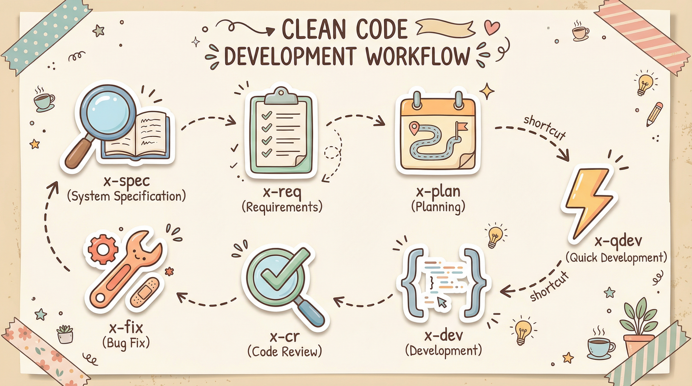

<p align="center">
  
</p>

# x-dev-pipeline

[中文说明](./README_zh.md)

> A recordable, auditable, and reviewable workflow framework for AI-assisted development.

Most of the time, AI coding agents don't fail because they can't write code — they fail because they drift off track mid-task, and leave behind little useful process information:

- Why was this change made?
- What exactly was modified?
- What decisions were made along the way?
- Which issues have already been addressed?
- Which risks are still unresolved?

When someone picks up the work later, they're forced to re-ask, re-read, and re-analyze from scratch.

`x-dev-pipeline` exists to solve this problem.

It turns throwaway, chat-style development into something closer to real engineering: get things done, leave a clear trail, and keep reviewing, fixing, and iterating.

> Battle-tested on Claude Code. Designed to work with any AI coding tool.

## Start with `/x-qdev`

If this is your first time using this repo, don't jump into the full pipeline right away.

Try `/x-qdev` first:

```bash
/x-qdev add dark mode toggle to the settings page
```

It's best for:

- Adding a small feature to a page
- Making a localized optimization
- Modifying a small module
- Filling in an interaction detail
- Running a lightweight validation

What you get isn't just "one reply" — it's a process closer to real development:

1. AI understands the task scope
2. Creates a task directory
3. Generates a task description and dev checklist
4. Implements items one by one, recording key changes
5. Leaves artifacts ready for follow-up review and fix

Typical output looks like this:

```text
.claude/tasks/<task-name>/
├── README.md
├── changelog.md
└── cr-report-*.md
```

This is the best way to experience `x-dev-pipeline` for the first time:

**Complete a small feature smoothly, and leave an engineering trail behind.**

## It's not about "can AI write code" — it's about "how to make development more reliable"

Common problems when using AI coding agents directly:

- The task is small, but the process is messy
- Changes are made, but no clear record is left
- Reviews are ad-hoc and inconsistent in quality
- Work ends after the fix, with no feedback loop
- The next person picking it up has no idea what happened before

`x-dev-pipeline` doesn't solve "can AI generate code" — it solves:

**How to make AI work at a more stable, traceable, engineering-grade pace.**

## Recommended Loop: Build → Review → Fix

For day-to-day development, this is the path I recommend most:

```text
/x-qdev -> /x-cr -> /x-fix
```

### `/x-qdev`

Quickly ship a small feature, tweak, or module.

### `/x-cr`

Run a structured review on the completed changes — no more "looks fine at a glance."

### `/x-fix`

Fix issues from the review report, closing the feedback loop for real.

This path is great for:

- Small feature iterations
- UI interaction additions
- Module tweaks
- Localized optimizations
- Small-scale refactors

The point isn't to make the process heavy — it's to give even small tasks a sense of engineering discipline.

## What You Get

With `x-dev-pipeline`, you don't get a throwaway chat log — you get a set of artifacts you can continue using, tracking, and reviewing.

Typically, you'll get:

- Task directory
- Task description
- Dev checklist
- Changelog
- Code review report
- Fix result record

These artifacts mean:

- **Recorded**: you know what changed
- **Auditable**: you know why it changed
- **Reviewable**: you can pick up where you left off
- **Retrospectable**: you can look back at decisions and issues

This is one of the core values of this repo:

**Don't just get things done — turn the development process into truly traceable engineering assets.**

## For Complex Tasks, Use the Full Pipeline

`x-dev-pipeline` isn't just `/x-qdev`.

For more complex tasks, it provides a full development flow:

```text
x-spec -> x-req -> x-plan -> x-dev -> x-cr -> x-fix
                    ^
                 x-qdev
```

Think of it this way:

### Small Tasks

Start directly with `/x-qdev` — fast to complete, fast to ship.

### Medium Tasks

Start with `/x-req -> /x-plan -> /x-dev` — when you need clear requirements and an execution plan.

### Large Tasks

Walk the full pipeline — for system design, complex modules, and architecture-level changes.

In short:

- Keep it light for small things
- Keep it solid for big things
- Always close with review and fix

## What Each Command Does

### `/x-qdev`

Lightweight quick development entry point. Best for small features, localized optimizations, and module tweaks. The recommended way to start.

### `/x-cr`

Structured code review. Runs tiered checks on changes, flagging issues, risks, and improvement suggestions.

### `/x-fix`

Fix by review report. Review doesn't end at reading — problems get actually solved.

### `/x-req`

Requirements analysis. Turns a development task into a clear, structured requirements spec.

### `/x-plan`

Development plan. Breaks down requirements into steps, scope, and execution order.

### `/x-dev`

Execute the plan. Development with a checklist, status tracking, and a changelog.

### `/x-spec`

System architecture planning. For larger projects, complex modules, architecture design, or long-term evolution tasks.

## Installation

### Claude Code

```bash
git clone https://github.com/KtKID/x-dev-pipeline.git ~/.claude/plugins/x-dev-pipeline
```

Register the local marketplace:

```bash
cd ~/.claude/plugins/x-dev-pipeline
claude plugin marketplace add ./.claude-plugin/marketplace.json
```

Install the plugin:

```bash
claude plugin install x-dev-pipeline@x-dev-pipeline --scope user
```

### Codex

Clone to the local plugin directory:

```bash
mkdir -p ~/.codex/plugins
git clone https://github.com/KtKID/x-dev-pipeline.git ~/.codex/plugins/x-dev-pipeline
```

Directory layout:

```text
~/
├── .agents/
│   └── plugins/
│       └── marketplace.json
└── .codex/
    └── plugins/
        └── x-dev-pipeline/
```

The current official way to install local plugins is to manually maintain `~/.agents/plugins/marketplace.json`, then open the plugin directory in Codex to install. There's no standalone `plugin install` subcommand, but the official docs provide an interactive entry:

```bash
codex
/plugins
```

You'll need to manually add the local marketplace entry:

```json
{
  "name": "local-plugins",
  "interface": {
    "displayName": "Local Plugins"
  },
  "plugins": [
    {
      "name": "x-dev-pipeline",
      "source": {
        "source": "local",
        "path": "./.codex/plugins/x-dev-pipeline"
      },
      "policy": {
        "installation": "AVAILABLE",
        "authentication": "ON_INSTALL"
      },
      "category": "Productivity"
    }
  ]
}
```

You can also reference the example file in the repo:

```text
examples/codex-marketplace.json
```

Two things to note:

- `source.path` is resolved relative to the root directory where `~/.agents/plugins/marketplace.json` lives
- For personal marketplaces, the common pattern in the official docs is `./.codex/plugins/<plugin-name>`

If you already have `~/.agents/plugins/marketplace.json`, just append the plugin entry above to the `plugins` array — don't overwrite existing plugins. Save, restart Codex, then run:

```bash
codex
/plugins
```

Find `x-dev-pipeline` in the plugin directory and install it. (You may need to switch to Local.)

After installation, try this to get started:

```bash
/x-qdev add dark mode toggle to the settings page
```

## Who Is This For

This repo is especially suited for:

- Developers using AI coding agents daily who want a more disciplined process
- People who want AI development to feel more like engineering, not just chat
- Anyone who wants every change to leave a clear record
- Those who want review and fix to form a real feedback loop
- People looking to build a stable, repeatable development rhythm

## Who It's Not For (Yet)

This repo might not be the best fit if you currently need:

- A zero-config, plug-and-play general-purpose coding assistant
- A heavy enterprise process management platform

## Adapting to Other Tools

`x-dev-pipeline`'s workflow design is not tied to any specific tool. It's been deeply validated on Claude Code, but the core principles apply to all AI coding agents:

- Small tasks should ship fast
- Every change should be recorded
- Every decision should be traceable
- Reviews shouldn't stay verbal
- Fixes should close the loop

If you're using another tool (Cursor, Codex, Windsurf, Cline, etc.), just tell your AI:

> "Keep the x-dev-pipeline workflow intact, but adapt it to Cursor (or whatever tool you're using)."

The AI will adjust task directory locations and trigger mechanisms based on the target tool's conventions, while preserving the full workflow chain.

> **Note**: The default task output directory in the skills is `.claude/tasks/`. During adaptation, the AI may ask whether you'd like to change it to a different path (e.g., `.codex/tasks/`) — just confirm based on your setup.

## Shared Status Markers

All skills share a unified task status system:

| Symbol | Status | Description |
|--------|--------|-------------|
| ⏳ | Not started | Waiting to be picked up |
| ▶️ | In progress | Currently being worked on |
| 🟡 | Pending test | Development done, awaiting verification |
| 🔴 | Test failed | Needs fix |
| 🟢 | Test passed | Verified, awaiting review confirmation |
| ✅ | Completed | Confirmed after review |

### Priority Levels

| Priority | Description |
|----------|-------------|
| P0 | Blocker — must be addressed immediately |
| P1 | Important — must be completed |
| P2 | Enhancement — can be deferred |

## Core Philosophy

The goal isn't to make the process heavy — it's to make development:

**Structured when you need it, lightweight when you don't.**

It's not a rigid methodology you must follow end-to-end. It's a workflow toolkit you can freely pick from based on task complexity.

## Roadmap

We'll continue strengthening these areas:

- Smoother `/x-qdev` first-time experience
- Clearer task artifact structure
- Stronger review / fix feedback loops
- More real-world usage examples
- Better multi-language, multi-stack support
- Official adapters for more tools (Cursor, Codex, Windsurf, etc.)

## License

MIT
