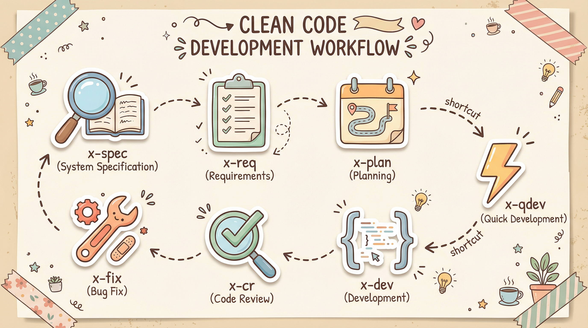

<p align="center">
  
</p>

# x-dev-pipeline

[中文说明](./README_zh.md)

**Current release:** v0.3.6

> An auditable development workflow for AI coding agents.

`x-dev-pipeline` turns a request into a task contract, implementation evidence, deterministic verification, and risk-matched review. README owns requirements and acceptance scenarios; dev-report owns executable evidence; git history owns repository changes.

## Start with `/x-req`

Create every task through one entry point. `/x-req` assigns a Q0–Q3 risk level, writes a lean task package, and continues to x-dev.

```text
/x-req add a dark-mode toggle to the settings page
```

Q1 is a typical first task: x-req records the reason for its low-risk rating, creates the task, x-dev implements it, and `xdev.py verify` checks the declared evidence.

```text
dev-pipeline/tasks/<task-name>/
├── README.md            # risk, architecture, acceptance scenarios
├── dev-checklist.md     # dependency-aware execution state
├── diagram.md           # optional
└── dev-report.md        # created by x-dev; fenced verify blocks
```

## One risk-routed flow

```text
user request → x-req → x-dev → xdev.py verify
                                  ├─ Q0 / Q1 → delivery receipt
                                  ├─ Q2 → x-qa-gate RC
                                  └─ Q3 → x-qa-gate R1 → R2 → R3
                                               │
                              issue candidates → xdev.py flag → x-fix → incremental review
                                                   │
                                      issue ledger + `[!] 🔴`
```

| Risk | Typical scope | Route after verify |
|------|---------------|-------------------|
| Q0 | Single-file, no behavior branch change | Delivery receipt |
| Q1 | Local feature or fix without cross-module contract change | Delivery receipt |
| Q2 | New feature, multiple files, contract or state change | RC review |
| Q3 | Security, irreversible writes, public API/schema, concurrency or state-machine change | R1 → R2 → R3 |

The user can explicitly set the risk. Q0/Q1 prepare and execute directly; Q2/Q3 show one confirmation before task files are written.

## Adversarial Spec risk

Spec3 packages use a risk gate before task decomposition:

```text
user request → x-spec3 → x-adversarial-risk → x-req3 → x-dev
                    score + initial tests   adversarial tests
```

x-spec3 records 1–5 complexity and importance scores and marks first-draft Scenarios as `initial-spec`. x-adversarial-risk selects a standard, deep, or full budget; deep/full runs load its private mistake corpus and append only applicable counterexample Scenarios with `adversarial-review` provenance. x-req3 blocks a versioned Spec while its adversarial review is pending.

## Acceptance and evidence

Each README acceptance section uses Requirement/Scenario structure:

```markdown
### Requirement: Theme setting

#### Scenario: Toggle persists after reload
- **WHEN** the user enables dark mode and reloads the page
- **THEN** the page remains in dark mode
- 验证: auto
```

Every automatic Scenario has a matching `verify` block in `dev-report.md`:

````markdown
```verify
id: S1
scenario: Toggle persists after reload
cmd: npm test -- theme-setting
expect_exit: 0
expect_contains: passed
```
````

`python3 tools/xdev.py verify <task-dir> --json` re-runs auto blocks, compares exit codes and output fragments, lists manual steps, and reports auto Scenarios without evidence. Exit 0 means every automatic fact passed; exit 1 means a command or coverage failure; exit 2 means input, path, or schema error.

## Commands

| Command | Purpose |
|---------|---------|
| `/x-req` | Classify Q0–Q3 risk and prepare/update a task package |
| `/x-dev` | Implement checklist work and write verify evidence |
| `/x-verify` | Run deterministic Gate ① and diagnose failures |
| `/x-qa-gate` | Run Gate ②: RC for Q2, R1/R2/R3 for Q3 |
| `/x-fix` | Batch-fix verify, gate, or CR issues |
| `/x-cr` | Investigate a reported correctness issue, module, diff, or PR |
| `/x-spec` | Create a system-level architecture and task map |
| `/x-adversarial-risk` | Challenge a Spec's risk assumptions and add traceable counterexample Scenarios |
| `/x-multi-llm-align` | Align a protocol, data structure, or process across agents |
| `/x-audit-perf` | Run an independent performance audit |
| `/x-audit-style` | Run an independent style audit |
| `/x-audit-arch` | Run an independent architecture audit |

## Deterministic engine

`tools/xdev.py` provides the unified CLI for mechanical rules outside skill prose. Verify parsing,
execution, and Scenario reconciliation are owned by `tools/verify.py`:

```text
validate [pkg...]                 validate specs, changes, and task contracts
status <task-dir> [--json]        parse checklist progress
graph <task-dir> [--json]         calculate ready work and parallel batches
instructions <artifact> --task    return task artifact instructions
scaffold <task-dir>               create only missing task artifacts
verify <task-dir> [--json]        execute evidence and reconcile Scenarios
flag <task-dir> --task T2,T3 --severity P0 --loc src/a.py:10 --msg "..." [--new-round] [--json]
```

Task validation covers V8–V12: required files, checklist contract, optional diagram consistency, README risk and required sections, and Requirement/Scenario structure.

## x-spec2 pilot metrics

`tools/metrics.py` records a completed x-spec2 eval from either one explicit Codex rollout JSONL or a saved subagent completion notification. The minimum measurement contains the execution source ID, model, repository SHA, prompt hash, duration, real provider total tokens, and independently graded expectation pass rate.

```bash
python3 tools/metrics.py extract \
  --timing <run-dir>/timing.json \
  --metadata <run-dir>/eval_metadata.json \
  --grading <run-dir>/grading.json \
  --output <run-dir>/measurement.json

python3 tools/metrics.py aggregate-spec2 skills/x-spec2-workspace/iteration-2
```

Exit 0 means extraction or aggregation succeeded; exit 1 means a readable run violates the fresh-session, rubric-isolation, or paired-comparison boundary; exit 2 means usage, IO, JSON, or schema failure. A one-pair result is marked `pilot: true`: it proves the measurement flow and remains insufficient for a stable skill-effect estimate.

## Reports and recovery

- Gate ① returns a short pass receipt. Failures create `reports/verify/verify-report-*.md` with facts for x-fix.
- Gate ② reviewers return unnumbered task/severity/location/message candidates. The main agent calls `xdev.py flag` for each candidate; code assigns `issue-<n>` and writes `reports/qa-gate/qa-gate-report-*.md`.
- `flag` uses a durable transaction marker to update the issue ledger and checklist. P0/P1 targets become `[!] 🔴`; P2 keeps every task state unchanged. A recovered pending transaction returns `recovered:true`, and the caller repeats the intended new issue.
- x-fix handles the full issue list in one batch while preserving the ledger and checklist state cells. The main agent upgrades resolved tasks after incremental review. Verify and Gate ② share the existing three-round fix counter.
- Manual acceptance steps stay visible in the verify receipt until a user confirms them.

## Installation

The repository contains manifests for Claude Code and Codex:

```text
.claude-plugin/plugin.json
.claude-plugin/marketplace.json
.codex-plugin/plugin.json
.agents/plugins/marketplace.json
```

For Claude Code:

```bash
git clone https://github.com/KtKID/x-dev-pipeline.git ~/.claude/plugins/x-dev-pipeline
claude plugin marketplace add ~/.claude/plugins/x-dev-pipeline/.claude-plugin/marketplace.json
claude plugin install x-dev-pipeline@x-dev-pipeline --scope user
```

For Codex, add the repo entry from `.agents/plugins/marketplace.json` to your marketplace, restart Codex, and install `x-dev-pipeline` from the local plugin directory.

## Status markers

| Marker | Meaning |
|--------|---------|
| `[ ] ⏳` | Not started |
| `[ ] ▶️` | In progress |
| `[ ] 🟡` | Waiting for declared verification |
| `[!] 🔴` | Verification failed |
| `[x] 🟢` | Verification passed |
| `[x] ✅` | Risk route completed |

## License

MIT
