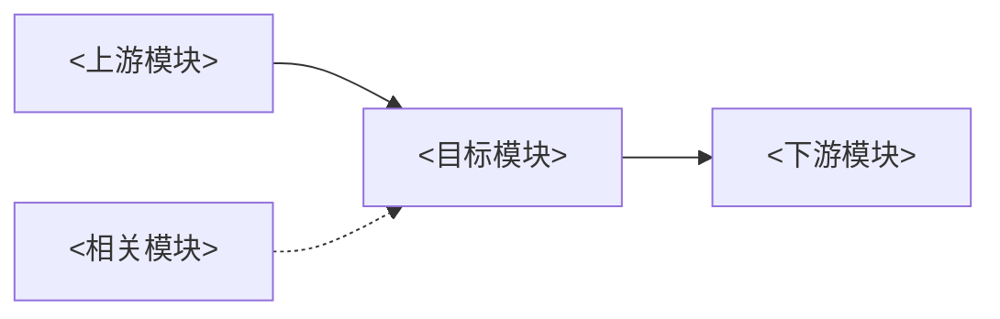

# <TASK_NAME> · 影响边界图

<!--
填写后删除本注释和占位节点。
- 节点名来自 spec.md“影响边界与不变量”表的“模块”列，每个模块恰好一个节点。
- 连线表达上游 → 目标 → 下游；相关模块用虚线连接。
- 图只投影边界与依赖，不增加新的模块或设计事实。
-->

```mermaid
flowchart LR
  Upstream["<上游模块>"]
  Target["<目标模块>"]
  Downstream["<下游模块>"]
  Related["<相关模块>"]

  Upstream --> Target --> Downstream
  Related -.-> Target
```
