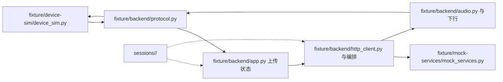

# voice-chain-backend · 影响边界图

```mermaid
flowchart LR
  Device["fixture/device-sim/device_sim.py"]
  Protocol["fixture/backend/protocol.py"]
  App["fixture/backend/app.py 上传状态"]
  HTTP["fixture/backend/http_client.py 与编排"]
  Audio["fixture/backend/audio.py 与下行"]
  Mock["fixture/mock-services/mock_services.py"]
  Sessions["sessions/<session_id>/"]

  Device --> Protocol --> App --> HTTP --> Mock
  HTTP --> Audio --> Protocol --> Device
  Sessions -.-> App
  Sessions -.-> HTTP
```
