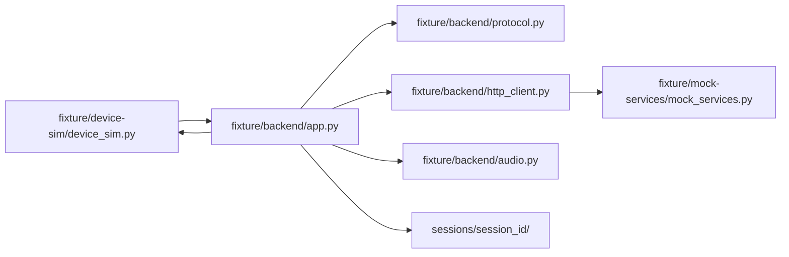

# backend · 影响边界图

```mermaid
flowchart LR
  Device["fixture/device-sim/device_sim.py"]
  App["fixture/backend/app.py"]
  Protocol["fixture/backend/protocol.py"]
  Http["fixture/backend/http_client.py"]
  Audio["fixture/backend/audio.py"]
  Mock["fixture/mock-services/mock_services.py"]
  Sessions["sessions/session_id/"]

  Device --> App
  App --> Protocol
  App --> Http --> Mock
  App --> Audio
  App --> Sessions
  App --> Device
```
