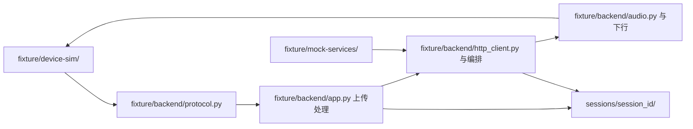

# backend-end-to-end · 影响边界图

```mermaid
flowchart LR
  Device["fixture/device-sim/"]
  Protocol["fixture/backend/protocol.py"]
  Upload["fixture/backend/app.py 上传处理"]
  Upstream["fixture/backend/http_client.py 与编排"]
  Mock["fixture/mock-services/"]
  Audio["fixture/backend/audio.py 与下行"]
  Sessions["sessions/session_id/"]

  Device --> Protocol --> Upload --> Upstream
  Mock --> Upstream
  Upstream --> Audio --> Device
  Upload --> Sessions
  Upstream --> Sessions
```
