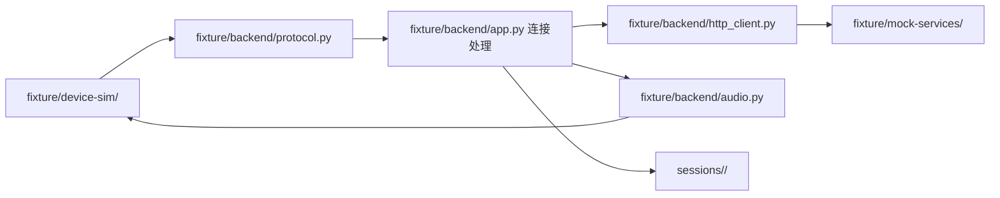

# end-to-end · 影响边界图

```mermaid
flowchart LR
  Device["fixture/device-sim/"]
  Protocol["fixture/backend/protocol.py"]
  App["fixture/backend/app.py 连接处理"]
  Http["fixture/backend/http_client.py"]
  Audio["fixture/backend/audio.py"]
  Mock["fixture/mock-services/"]
  Sessions["sessions/<session_id>/"]

  Device --> Protocol --> App
  App --> Http --> Mock
  App --> Audio --> Device
  App --> Sessions
```
