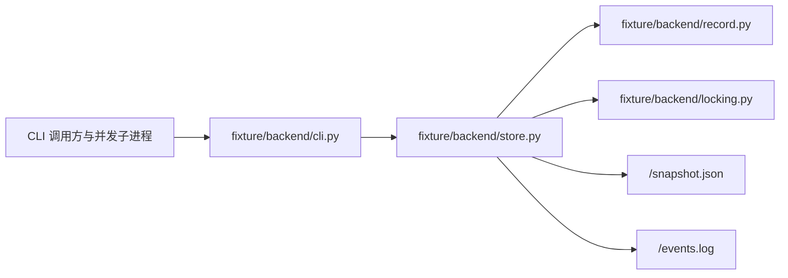

# implement-journal-index-recovery · 影响边界图

```mermaid
flowchart LR
  Caller["CLI 调用方与并发子进程"]
  Cli["fixture/backend/cli.py"]
  Store["fixture/backend/store.py"]
  Record["fixture/backend/record.py"]
  Lock["fixture/backend/locking.py"]
  Snapshot["<state-dir>/snapshot.json"]
  Events["<state-dir>/events.log"]

  Caller --> Cli --> Store
  Store --> Record
  Store --> Lock
  Store --> Snapshot
  Store --> Events
```
