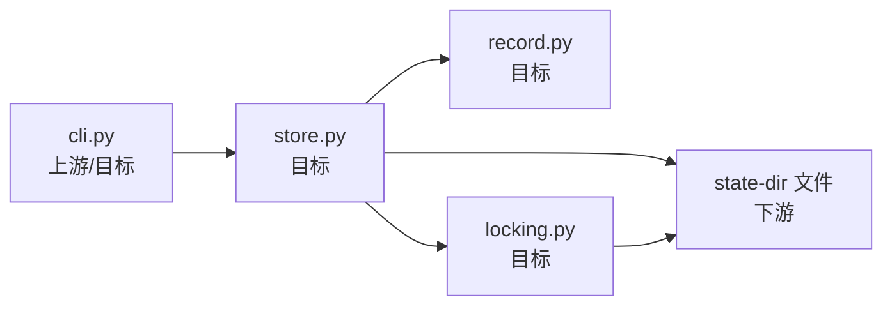

# journal-store · 影响边界图

```mermaid
flowchart LR
  CLI["cli.py<br/>上游/目标"]
  Record["record.py<br/>目标"]
  Store["store.py<br/>目标"]
  Lock["locking.py<br/>目标"]
  Files["state-dir 文件<br/>下游"]

  CLI --> Store
  Store --> Record
  Store --> Lock
  Store --> Files
  Lock --> Files
```
