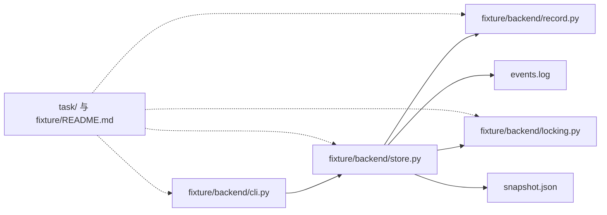

# implement-journal-index · 影响边界图

```mermaid
flowchart LR
  CLI["fixture/backend/cli.py"]
  Record["fixture/backend/record.py"]
  Store["fixture/backend/store.py"]
  Lock["fixture/backend/locking.py"]
  Log["events.log"]
  Snapshot["snapshot.json"]
  Inputs["task/ 与 fixture/README.md"]

  CLI --> Store
  Store --> Record
  Store --> Lock
  Store --> Log
  Store --> Snapshot
  Inputs -.-> CLI
  Inputs -.-> Record
  Inputs -.-> Store
  Inputs -.-> Lock
```
