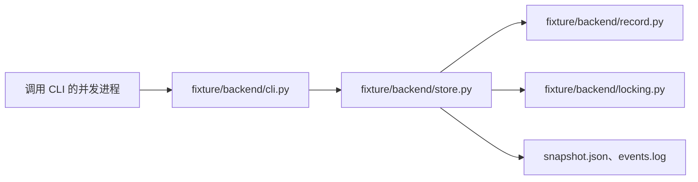

# implementation · 影响边界图

```mermaid
flowchart LR
  Caller["调用 CLI 的并发进程"]
  CLI["fixture/backend/cli.py"]
  Store["fixture/backend/store.py"]
  Record["fixture/backend/record.py"]
  Lock["fixture/backend/locking.py"]
  Files["snapshot.json、events.log"]

  Caller --> CLI --> Store
  Store --> Record
  Store --> Lock
  Store --> Files
```
