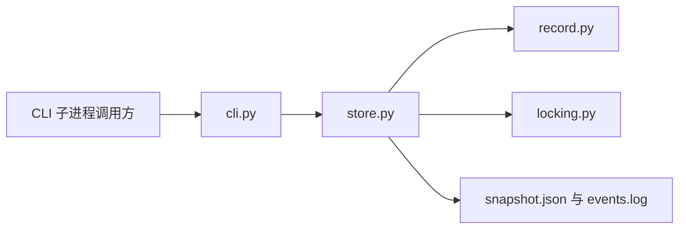

# journal-store · 影响边界图

```mermaid
flowchart LR
  CLI["cli.py"]
  Store["store.py"]
  Record["record.py"]
  Lock["locking.py"]
  Files["snapshot.json 与 events.log"]
  Caller["CLI 子进程调用方"]

  Caller --> CLI --> Store
  Store --> Record
  Store --> Lock
  Store --> Files
```
