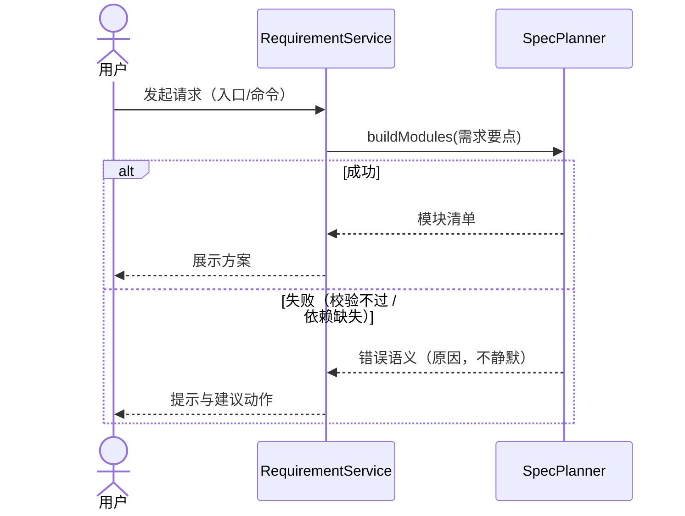
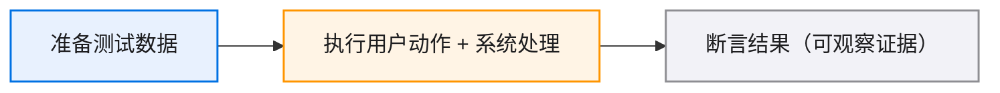

# 核心流程与时序

> 跨模块协作（调用顺序、错误路径、异步边界）的唯一载体：02 按模块切块、04 是静态数据，只有这里把"模块之间怎么配合"显性化。流程文字与时序图同文件同源——改一个流程只动本文件。
>
> 默认必有：最小可用路径 1 条（含错误路径），随 01 一起交用户确认；可选：最高风险链路、E2E 验收链路。图表写法见 `TEMPLATE_GUIDE.md`「图表规范」。

<!-- 模板说明：skills/x-spec/templates/TEMPLATE_GUIDE.md。生成产物时删除本注释。 -->

## 流程 1：<最小可用路径名>（必有）

**目标**：[用户做什么 → 系统处理什么 → 用户看到什么，一句话]

**参与模块**：[模块 A（边界类）→ 模块 B（边界类）]

**关键步骤**（文字为真源，图与此一致）：

1. ...
2. ...
3. 失败分支：[哪一步可能失败 → 系统怎么表现 → 用户看到什么]

## 流程 2：<最高风险链路名>（可选，链路风险高时才写）

[同流程 1 结构：目标 / 参与模块 / 关键步骤 / 时序图]

## E2E 验收链路（可选，验收复杂到文字说不清时才画）

[从测试数据准备、用户动作、系统处理到断言的验证路径；与 `./05-validation-and-evolution.md` 的 Smoke/E2E 入口一致]

