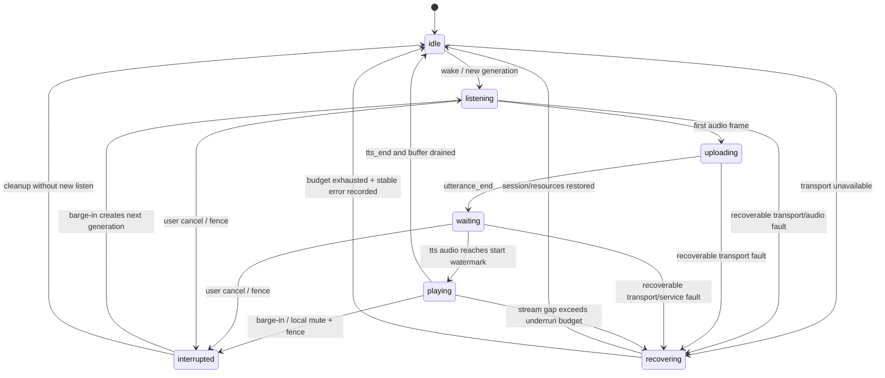
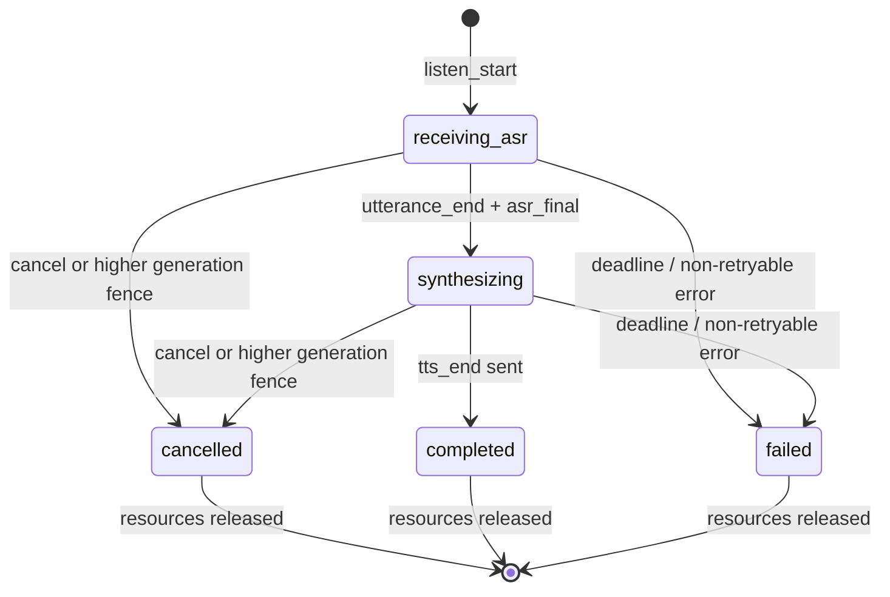
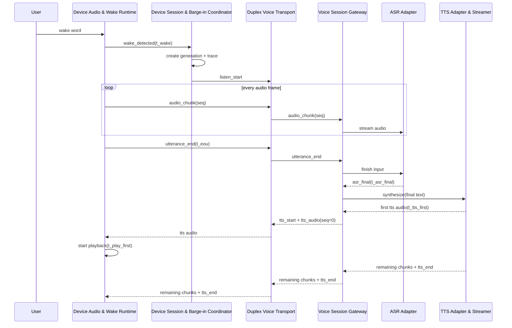

# 动态链路设计

本文集中描述六元组动态行为。Requirement 名称来自 `spec.md`，Module 名称来自 `modules.md`；后续 x-req 应保持这些名称和边界稳定。

## 数据流

### 正常主链路

```mermaid
flowchart LR
    MIC["StackChan 麦克风"] --> DWR["Device Audio & Wake Runtime"]
    DWR --> DSC["Device Session & Barge-in Coordinator"]
    DWR --> DVT["Duplex Voice Transport"]
    DVT --> VSG["Voice Session Gateway"]
    VSG --> ASR["ASR Adapter"]
    ASR -->|"final text"] VSG
    VSG --> TTS["TTS Adapter & Streamer"]
    TTS -->|"streaming audio"] VSG
    VSG --> DVT
    DVT --> DSC
    DSC --> DWR
    DWR --> SPK["StackChan 扬声器"]
    DWR -. "events/metrics" .-> OBS["Observability & SLO"]
    DVT -. "events/metrics" .-> OBS
    VSG -. "spans/metrics" .-> OBS
    ASR -. "spans/metrics" .-> OBS
    TTS -. "spans/metrics" .-> OBS
```

1. Device Audio & Wake Runtime 检测 wake，Device Session & Barge-in Coordinator 创建 generation 和 trace。
2. 麦克风 PCM 经 DMA 进入有界采集环形缓冲，按协商帧长形成 `audio_chunk`；Duplex Voice Transport 分配上行 seq 并发送。
3. Voice Session Gateway 验证 session、generation、epoch、格式与 seq，把连续有效帧交给 ASR Adapter。
4. `utterance_end` 封口 ASR；唯一有效 `asr_final` 交给 TTS Adapter & Streamer。
5. TTS 首块可用即经 Voice Session Gateway 和 Duplex Voice Transport 下发；设备按 generation fence 和 seq 校验后写入播放抖动缓冲。
6. 达到启动水位后 Device Audio & Wake Runtime 获取 playback owner，持续向 I2S/DMA 供给样本；`tts_end` 后排空并释放所有权。

### 数据帧规则

- 上行和下行各自维护 seq；接收端对重复帧执行幂等丢弃，对小窗口乱序暂存，对超窗缺口触发 NACK/错误并受 deadline 限制。
- 音频帧具有硬性最大尺寸，控制帧具有独立容量。取消、心跳和错误控制消息获得比音频更高的调度优先级。
- 上行缓冲建议上限为 2 秒音频，下行抖动缓冲建议目标 60–120 ms、硬上限 500 ms；数值需以 A1/A3 真机压测确认。
- 下行 TTS 仅在 credit 可用时继续读取或发送；持续背压到达 deadline 时取消 generation，避免无界服务端缓存。
- 设备和服务端仅保留恢复窗口内的未确认帧；generation 取消后对应帧立即从重传集合移除。

本节落实 R3 设备语音采集与上行、R4 服务端 ASR 转写、R5 TTS 流式回传与设备播放、R8 全链路关联观测和 R9 波动恢复与稳定运行。

## 状态模型

### 设备权威状态机



`listening` 与 `uploading` 在实现中可以用层级/并行子态表达：麦克风持续采集时首包发送后进入 uploading，采集结束才退出。对外状态事件必须保持单一权威顺序。

### 服务端 generation 状态机



### 合法转换与守卫

| 当前状态 | 事件 | 必须守卫 | 动作与下一状态 |
|---|---|---|---|
| idle | valid wake | session 可用或可在预算内建立；唤醒防抖通过 | 递增 generation，分配 trace/采集资源，进入 listening |
| listening/uploading | utterance_end | generation 等于 current 且未取消 | 停止采集、发送封口、进入 waiting |
| waiting | valid tts audio | generation 等于 current，seq 连续，格式兼容 | 获取 playback owner，达到水位后进入 playing |
| listening/uploading/waiting/playing | cancel/barge-in | 事件对应当前 generation | 先提升 fence；playing 立即静音；清理后进入 interrupted |
| interrupted | new listen | 新 generation 大于 cancelled fence | 清空旧缓冲，重新获取采集资源，进入 listening |
| 任一活跃态 | recoverable fault | retry budget 和总 deadline 尚有余量 | 释放受损资源，进入 recovering |
| recovering | recovery success | 新 transport_epoch 已确认，当前 generation 连续性可证明 | 仅允许协议定义的安全续传；否则终止 generation 回 idle |
| 任一状态 | stale event | generation 小于等于 cancelled/completed fence | 丢弃并记录原因，状态保持不变 |

非法转换必须产生 `invalid_transition` 事件；事件不得隐式创建、复活或回退 generation。

本节落实 R2 唤醒词触发监听、R5 TTS 流式回传与设备播放、R7 播放抢占与取消传播和 R9 波动恢复与稳定运行。

## 时序与延迟预算

### 正常交互时序



### 打断时序

```mermaid
sequenceDiagram
    participant U as User
    participant D as Device Audio & Wake Runtime
    participant C as Device Session & Barge-in Coordinator
    participant X as Duplex Voice Transport
    participant G as Voice Session Gateway
    participant T as TTS Adapter & Streamer

    U->>D: wake word during playback
    D->>C: barge_in(old generation)
    C->>D: mute + flush old playback buffer
    C->>C: raise cancelled fence; create new generation
    C->>X: priority cancel(old generation)
    par local new listen
        C->>D: start capture(new generation)
    and remote cancellation
        X->>G: cancel(old generation)
        G->>G: raise cancelled fence + drop queued chunks
        G->>T: cancel request
        T-->>G: cancellation complete
        G-->>X: cancel_ack
        X-->>C: cancel_ack
    end
    Note over D,G: Any late old-generation audio/result is dropped by both fences
```

本地静音不等待网络和 cancel_ack。远端取消确保服务资源及时收敛；两条路径以同一个旧 generation 关联。

### 建议阶段预算和测量口径

| 指标 | 起点 | 终点 | 建议目标 | 测量与条件 |
|---|---|---|---|---|
| wake_to_uplink_first | Device Audio & Wake Runtime 产生 `wake_detected` | Duplex Voice Transport 提交首个上行帧 | p95 ≤ 200 ms | 同一设备单调时钟；含采集启动与首帧形成。 |
| eou_to_asr_final | Voice Session Gateway 接收 `utterance_end` | 网关接受唯一 `asr_final` | p95 ≤ 800 ms | 服务端单调时钟；含尾包传输和 ASR 收尾。 |
| asr_final_to_tts_first | 网关接受 final | 网关收到首个 TTS 音频块 | p95 ≤ 500 ms | 服务端单调时钟；含 TTS 排队和首块生成。 |
| eou_to_play_first | 设备发送 utterance_end | Device Audio & Wake Runtime 向播放 DMA 提交首个有效样本 | p95 ≤ 1500 ms | 通过 trace/span 合成；受控网络 RTT ≤ 50 ms、丢包 ≤ 1%。 |
| barge_in_to_silence | 设备确认有效 barge-in | 播放 DMA 停止旧 generation 输出 | p95 ≤ 100 ms，max ≤ 150 ms | 同一设备单调时钟；压力条件含满播放缓冲。 |
| barge_in_to_server_cancel | 设备确认有效 barge-in | Voice Session Gateway 提升 cancelled fence | p95 ≤ 300 ms | 含控制队列与网络；连接断开时以本地 fence 成功为安全判据，远端在重连后首个控制消息收敛。 |

基线压测固定板卡、固件、服务版本、音频样本、并发、网络条件和预热策略，每个场景至少 100 次，报告 p50/p95/p99、样本数与误差样本 trace_id。A5 确认后把建议目标冻结为发布 SLO。

本节落实 R6 端到端低延迟预算、R7 播放抢占与取消传播和 R8 全链路关联观测。

## 资源模型

| 资源 | 权威所有者 | 建议容量/并发 | 获取与释放 | 压力策略与证据 |
|---|---|---|---|---|
| 麦克风 I2S/DMA | Device Audio & Wake Runtime | 单实例；DMA 双/多缓冲，容量由 BSP 验证 | listening 前获取；utterance_end、cancel、故障时停止 DMA 并释放 | DMA overrun 计数；不得动态扩容。 |
| 扬声器 I2S/DMA | Device Audio & Wake Runtime | 单实例、单 playback owner | 达到播放水位后获取；end、barge-in、故障时静音并释放 | underrun 计数；barge-in 优先于正常 drain。 |
| 上行音频环形缓冲 | Device Audio & Wake Runtime | 建议最多 2 秒，最终按 PSRAM/带宽压测 | listen 创建；ack 后回收；cancel 全清 | 高/低水位、峰值字节、丢帧/终止原因。 |
| 下行抖动缓冲 | Device Audio & Wake Runtime | 目标 60–120 ms，硬上限建议 500 ms | tts_start 创建；播放消费；cancel/end 清理 | credit 控制、峰值水位、underrun/stale drop。 |
| 播放 owner token | Device Session & Barge-in Coordinator | 全设备恰好 0 或 1 个 | generation 验证后授予；barge-in 先撤销再清缓冲 | owner 冲突为严重不变量告警。 |
| 全双工连接 | Duplex Voice Transport | 每设备 1 条活跃连接；每重连新 epoch | session 前建立；认证失败/关机释放 | 心跳、RTT、重连次数、发送队列水位。 |
| 控制/音频发送队列 | Duplex Voice Transport | 控制队列独立保留容量；音频有硬上限 | 消息提交时入队；ack/cancel/deadline 回收 | cancel 永不受音频 credit 饥饿；队列峰值指标。 |
| 设备执行任务 | 各设备模块 | 音频 ISR、采集、播放、网络、状态协调按实时性分级 | 启动时静态创建优先；重启/停机释放 | 栈水位、调度延迟、看门狗和优先级反转监测。 |
| 服务端 generation context | Voice Session Gateway | 每设备最多 1 个 active generation；全局配额待容量规划 | listen_start 创建；completed/cancelled/failed 终态释放 | active gauge、生命周期、泄漏扫描。 |
| ASR/TTS 请求句柄 | ASR Adapter；TTS Adapter & Streamer | 每 active generation 各至多 1 个 | 阶段开始创建；final/end/cancel/deadline 释放 | 供应商并发、排队、取消耗时、孤儿句柄为零。 |
| 遥测队列 | Observability & SLO | 独立硬上限与批量发送 | 事件产生入队；成功或丢弃策略出队 | 遥测丢弃计数；不得反压实时链路。 |

资源容量是 A1/A3 的验证项。x-req 应把建议值变成可配置上限，并保持默认值满足目标板最小可用内存和任务栈预算。

本节落实 R1 StackChan ESP32-S3 平台约束、R3 设备语音采集与上行、R5 TTS 流式回传与设备播放、R7 播放抢占与取消传播和 R9 波动恢复与稳定运行。

## 系统不变量

| ID | 不变量 | 强制位置 | 失败证据与处置 |
|---|---|---|---|
| I1 | 任意时刻设备最多一个 playback owner；owner 必须等于当前有效 generation。 | Device Session & Barge-in Coordinator 授权；Device Audio & Wake Runtime 写 DMA 前复核 | 冲突时立即静音、提升严重告警、终止两个候选播放并回 idle。 |
| I2 | generation_id 在 session 内单调递增；cancelled/completed fence 只前进。 | 设备协调器与 Voice Session Gateway 各自维护 fence | 回退事件记 `generation_regression` 并丢弃。 |
| I3 | 已取消、完成、过期或未知 generation 的 ASR 结果、TTS 块和重传帧永不进入后续业务阶段或播放 DMA。 | 网关供应商回调入口、传输接收入口、播放入队入口三重检查 | stale-drop 指标按 module/reason 计数；故障注入断言扬声器输出为空。 |
| I4 | barge-in 的本地静音与 fence 提升先于新 generation 播放或远端 ack 等待。 | Device Session & Barge-in Coordinator | 时序断言和 100 ms 静音直方图；违反时设备强制重置音频输出。 |
| I5 | cancel 对同一 session+generation 幂等，传播覆盖 ASR、TTS、下行队列、重传集合与播放缓冲。 | Duplex Voice Transport、Voice Session Gateway、ASR Adapter、TTS Adapter & Streamer | 各层 `cancel_seen/cancel_done` 事件可关联，重复 cancel 不创建新副作用。 |
| I6 | 所有实时缓冲、队列、重试次数和恢复时长具有硬上限。 | 各资源所有者 | 水位与预算耗尽指标；越界时执行确定性降级或终止 generation。 |
| I7 | 同 generation 同方向的 seq 对有效载荷具有唯一含义；重复 seq 的载荷摘要不一致即协议错误。 | Duplex Voice Transport 与 Voice Session Gateway | 连接隔离、protocol_violation 事件和安全计数。 |
| I8 | 每次终态转换最终释放麦克风/扬声器、缓冲、请求句柄、计时器和 generation context。 | 设备协调器与服务端网关 | 终态资源断言、24 小时 soak 的稳定 gauge。 |
| I9 | 观测后端失效不阻塞音频、取消和状态转换。 | Observability & SLO 的异步有界队列 | 遥测丢弃可计数；实时阶段延迟仍满足预算。 |

关键竞争采用“fence 后提交”规则：任何异步回调在产生副作用前读取当前 fence；资源清理在 fence 提升后可重复执行；新 generation 获取资源前确认旧 owner 已撤销。

本节落实 R7 播放抢占与取消传播、R8 全链路关联观测和 R9 波动恢复与稳定运行。

## 故障恢复

### 恢复策略

- 每个 generation 具有总 deadline，各阶段具有子 deadline。重试同时受次数、总 deadline 和 cancelled fence 限制。
- 可重试操作采用指数退避加随机抖动；建议 200 ms 起步、上限 2 s、最多 3 次。实时音频阶段优先快速失败，最终值按服务 SLO 确认。
- Duplex Voice Transport 使用心跳和读写 deadline 判断半开连接。重连创建新 transport_epoch，先发送 session/generation/fence 与最后确认 seq 摘要，再决定续传或终止。
- 安全续传要求双方确认 session、generation 未取消、音频格式一致、seq 连续且仍在恢复窗口内。任一条件无法证明时终止当前 generation，清理缓存并回到可唤醒 idle。
- 断路器按 ASR/TTS 供应商与错误类别隔离；打开期间快速返回稳定错误，避免设备长时间 waiting。

### 故障矩阵

| 故障 | 检测 | 立即动作 | 有界恢复/降级 | 可观测证据 |
|---|---|---|---|---|
| Wi-Fi/物理连接中断 | socket 错误、连续心跳丢失 | 停止新发送，保持本地 fence 有效；播放缓冲不足则静音 | 在总 deadline 内退避重连并新建 epoch；连续性不明时终止 generation 回 idle | disconnect_reason、epoch、attempt、backoff、last_ack_seq |
| 半开连接 | heartbeat deadline | 标记连接不可用，优先保留 cancel 意图 | 关闭旧连接并重连；首个控制交换携带最高 cancelled fence | heartbeat_rtt、miss_count、reconnect_result |
| 上行背压/缓冲高水位 | credit 耗尽或环形缓冲越过高水位 | 暂停传输读取并记录压力；采集不可无限暂停 | 恢复到低水位继续；超过缓冲/deadline 时终止 utterance 并返回稳定错误 | uplink_buffer_ms、credit、overflow_count |
| 下行背压/设备缓冲满 | 设备 credit 为零 | TTS Adapter & Streamer 暂停读取/发送 | deadline 内等待 credit；预算耗尽取消 TTS，清空服务端块 | downlink_buffer_ms、tts_blocked_ms、cancel_reason |
| 音频 underrun | 播放 DMA 请求时无连续样本 | 输出短静音并记录 gap；禁止播放乱序块 | 短缺口在 jitter budget 内等待；持续缺口静音并终止 generation | underrun_count、gap_ms、last_seq |
| 缓冲溢出 | 写入将超过硬上限 | 拒绝新块/帧并保护内存 | 上行终止 utterance；下行取消 generation；回到 idle | buffer_name、high_watermark、dropped_bytes |
| 重复/乱序/缺口帧 | seq 窗口和摘要校验 | 重复同载荷丢弃；小乱序暂存；冲突载荷隔离连接 | 窗口内补齐；超窗或 deadline 到期终止 generation | duplicate、reorder_depth、missing_seq、protocol_violation |
| ASR 慢/超时/错误 | ASR 子 deadline、供应商错误 | 停止等待迟到结果，检查 retryable | 未产生 final 且仍在总预算内可重试；耗尽后 failed 并通知设备 | provider_code、attempt、asr_latency、stale_result_dropped |
| TTS 首块超时 | TTS 子 deadline | 取消当前供应商请求 | 尚未开始播放时可在预算内重试；已开始播放后失败即静音终止，避免声音切换 | tts_first_byte、attempt、play_started、failure_scope |
| TTS 流中断 | EOF/错误且无 tts_end | 停止继续入队，设备排空后静音 | 已播放流不做供应商重试拼接；终止 generation 并回 idle | last_tts_seq、played_ms、stream_error |
| 用户打断与网络故障并发 | 本地 barge-in 与 disconnect 同时发生 | 本地静音、提升 fence、持久保留最高 cancel 意图 | 重连握手首先同步 fence；旧 generation 永不续传 | local_cancel_ts、fence_sync_ts、stale_drop_count |
| 服务过载/限流 | 网关配额或供应商 429/503 | 快速拒绝新阶段，保护现有资源 | Retry-After 在总 deadline 内才重试；断路器打开后稳定降级 | queue_depth、limit_scope、breaker_state、retry_after |
| 设备音频任务卡死 | watchdog、栈水位/调度超时 | 静音、撤销 owner、记录复位原因 | 重置音频子系统或设备；启动后创建新 session，旧 session 全失效 | watchdog_task、reset_reason、boot_id |
| 遥测后端不可用 | exporter 失败、队列高水位 | 丢弃低优先级遥测，保留本地关键计数 | 独立退避恢复；不改变实时链路状态 | telemetry_drop、exporter_backoff、queue_watermark |

### 长稳与故障注入验收

24 小时 soak 至少混合以下事件：周期性网络抖动和断连、ASR/TTS 延迟与错误、随机 barge-in、上下行背压、重复/乱序/迟到帧、遥测后端不可用。验收条件：

- 设备堆/PSRAM、任务栈、DMA 描述符、发送/播放缓冲和服务端 active context 的稳态水位无单调增长。
- 每个 generation 最终进入 completed、cancelled 或 failed；设备最终进入 idle 或带明确恢复计时器的 recovering。
- 旧 generation 播放样本数为零，取消传播缺口为零，所有违反不变量的注入均被检测并隔离。
- 关键故障均能通过 trace_id 还原检测、决策、重试、终态与资源释放。

本节落实 R7 播放抢占与取消传播、R8 全链路关联观测和 R9 波动恢复与稳定运行。

## 可观测证据模型

### 必备结构化事件

| 阶段 | 事件 |
|---|---|
| 设备唤醒/采集 | wake_detected、listen_started、uplink_first、utterance_end、audio_overrun |
| 传输 | connected、session_acked、frame_acked、backpressure_on/off、heartbeat_timeout、reconnected、protocol_violation |
| ASR | asr_started、asr_first_partial、asr_final、asr_failed、stale_result_dropped |
| TTS | tts_started、tts_first_chunk、tts_end、tts_failed、tts_cancelled |
| 播放/取消 | play_started、play_underrun、play_ended、barge_in、local_silenced、cancel_sent、cancel_fenced、cancel_ack、stale_audio_dropped |
| 资源/终态 | buffer_watermark、resource_acquired/released、generation_completed/cancelled/failed、session_closed |

所有事件包含 module、event_name、monotonic_ts、session_id、generation_id、transport_epoch、trace_id、protocol_version、outcome/error_code；帧类事件增加 direction、seq、bytes、format 摘要。设备 boot_id 用于区分重启前后 session。

### 必备指标与告警

- R6 各阶段延迟直方图，按固件、板型、网络等级、ASR/TTS 供应商和结果分层。
- active session/generation、ASR/TTS 并发、缓冲水位、队列深度、credit、重连、重试、deadline、断路器状态。
- 音频 overrun/underrun、duplicate/reorder/missing、stale audio/result drop、invalid transition、cancel 传播耗时。
- 错误率、成功率、取消率、恢复成功率与 24 小时资源斜率。
- 告警至少覆盖 SLO 连续超限、不变量违反、资源接近硬上限、取消未收敛和服务断路器长时间打开。

常规日志遵守 A7；调试音频和完整文本使用独立授权通道、短期留存和审计记录。

## 设计决策待确认

| 决策 | 推荐基线 | 确认证据 |
|---|---|---|
| 板型与音频器件 | 固化一块目标 StackChan ESP32-S3 BOM，HAL 隔离变体 | 原理图、引脚表、I2S/DMA/PSRAM 真机自检 |
| 传输协议 | TLS 长连接、全双工、二进制音频帧、结构化控制帧 | ESP32-S3 内存/CPU、代理兼容、取消时延、重连压测 |
| 音频格式 | 上行 16 kHz/16-bit/mono/20 ms 起步；下行协商 | ASR/TTS 能力、带宽、编解码 CPU 与音质压测 |
| VAD 与 utterance end | 本地 VAD 加最大 utterance deadline | 噪声、远场和播放回声样本集 |
| 回声抑制 | 播放期间唤醒持续有效；AEC/参考信号能力待板卡确认 | 播放音量下的 wake 召回率、误唤醒率和 barge-in 时延 |
| 延迟阈值 | 采用 R6 建议预算 | 固定基线至少 100 次端到端压测 |
| 恢复窗口/重试 | 200 ms 起步、2 s 上限、最多 3 次且受总 deadline 限制 | 弱网故障注入和用户体验评审 |
| 认证与隐私 | TLS、设备身份、密钥轮换；默认不记录原始音频/完整文本 | 安全评审、威胁模型与数据留存审批 |
