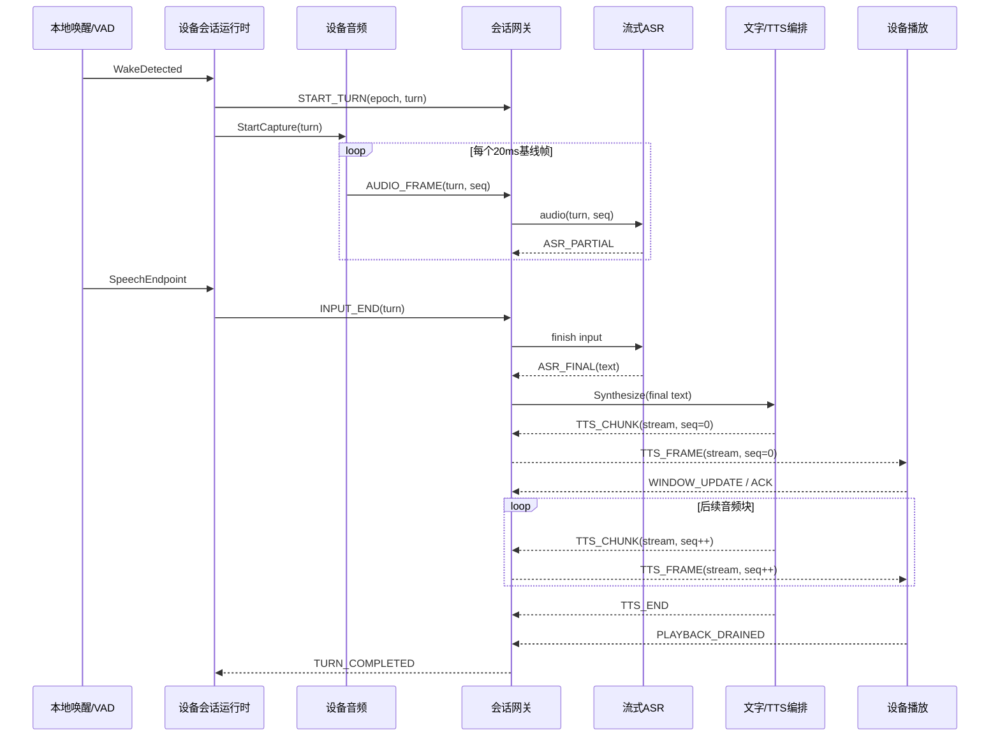
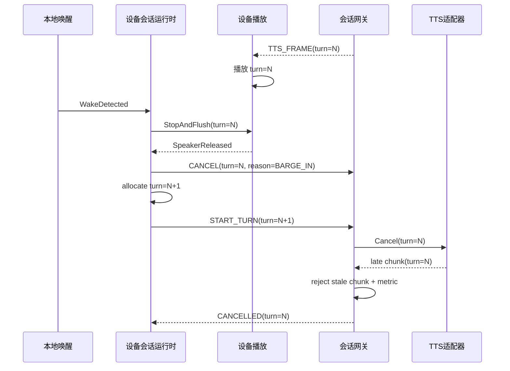

# 动态模型

## 数据流

### 关联信封

所有控制事件和媒体帧共享以下逻辑信封，字段语义由 `D1`、`D4`、`D7` 约束：

| 字段 | 产生者 | 用途 | 生命周期 |
|---|---|---|---|
| `device_id` | 设备身份配置 | 设备级关联、鉴权主体与容量归属 | 跨连接稳定 |
| `connection_epoch` | 设备传输层 | 区分重连前后的消息代次 | 每次成功握手递增 |
| `session_id` | 网关握手 | 关联一个在线会话及其轮次 | 当前连接会话 |
| `turn_id` | 设备会话运行时 | 区分每次唤醒创建的交互轮次 | 会话内单调递增 |
| `stream_id` | 媒体流产生者 | 区分上行采集流与下行 TTS 流 | 单个媒体流 |
| `seq` | 媒体流产生者 | 去重、检测缺口、按序消费与确认 | 流内从零单调递增 |
| `captured_at/produced_at` | 设备采集或服务器 TTS | 阶段时延与排队分析 | 随帧传递 |
| `trace_id` | 网关或握手协商 | 关联服务端调用与设备摘要 | 单轮次或其子调用 |

### 正常链路

1. StackChan 语音会话运行时确认本地唤醒，先分配 `turn_id`，再命令设备音频采集上行启动。
2. 设备音频采集上行按 `J4` 的协商格式产生 20 ms 基线帧，经实时语音传输发送 `START_TURN` 和 `AUDIO_FRAME`。
3. 服务端会话网关校验连接代次与活动轮次，将有序音频送入流式 ASR 适配器；ASR partial 只用于观测或可选 UI，ASR final 依据 `D5` 成为下游事实源。
4. 文字到 TTS 编排按 `D6` 规范化 final 文字并执行直通策略；首个 TTS 音频块产生后立即进入网关下行窗口。
5. 设备流式播放校验 `connection_epoch`、`turn_id`、`stream_id` 和 `seq`，把当前流写入有界抖动缓冲；达到启动水位后独占扬声器播放。
6. 设备以消费确认和窗口更新驱动网关流控；TTS 完成且播放缓冲排空后，设备与网关分别把轮次收敛为 `COMPLETED`。
7. 各阶段把状态、时延、错误和资源水位发送端到端遥测。设备离线时只在有界环形缓冲内保存摘要，重连后携带本地事件序号补传。

### 数据所有权与保留

| 数据 | 事实源/所有者 | 持久化与保留 |
|---|---|---|
| 当前设备轮次 | StackChan 语音会话运行时 | RAM；设备重启后清空，以新连接代次重新开始 |
| 服务端轮次状态 | 服务端会话网关 | 活动期内存；终态保留短期幂等窗口，期限由部署配置给出 |
| 上行/下行音频帧 | 对应媒体流产生者 | 仅存在于有界传输和播放缓冲；默认不进入日志或长期存储 |
| ASR final 文字 | 流式 ASR 适配器产生，网关确认归属 | 活动轮次内传递；默认遥测只记录长度、语言和摘要元数据，遵循 `J10` |
| 文字策略输出 | 文字到 TTS 编排 | 活动 TTS 请求内存；默认不长期保存 |
| 遥测事件 | 端到端遥测 | 设备侧有界环形缓冲，服务端按运维保留策略存储结构化元数据 |

## 状态流转

### 设备连接状态

状态所有者为实时语音传输：

| 当前状态 | 触发 | 下一状态 | 必需动作 |
|---|---|---|---|
| `DISCONNECTED` | 启动或退避到期 | `CONNECTING` | 创建套接字与连接期限 |
| `CONNECTING` | TLS/WebSocket 与能力握手成功 | `READY` | 递增 `connection_epoch`，清零退避，发布连接就绪 |
| `CONNECTING` | 连接失败或超时 | `BACKING_OFF` | 关闭句柄，记录分类错误，计算带抖动退避 |
| `READY` | 心跳超时、协议错误或套接字关闭 | `BACKING_OFF` | 发布断连，终止当前轮次，释放发送队列 |
| `BACKING_OFF` | 退避到期 | `CONNECTING` | 发起下一次有界重连 |
| 任意状态 | 设备停机 | `STOPPED` | 停止定时器并释放网络资源 |

初始退避暂定为 500 ms，指数增长至 10 s 上限并加入全抖动；这些值随 `J9` 一并校准。连接恢复只创建新代次，遵循 `D4`。

### 设备语音状态

状态所有者为 StackChan 语音会话运行时：

| 当前状态 | 触发 | 下一状态 | 必需动作 |
|---|---|---|---|
| `IDLE` | 有效本地唤醒且连接 `READY` | `LISTENING` | 创建新轮次、租用采集资源、发出 `START_TURN` |
| `LISTENING` | VAD 端点或最大录音期限 | `WAITING_RESPONSE` | 停止采集并幂等发送 `INPUT_END` |
| `LISTENING` | 当前 TTS 可播首帧提前到达 | `PLAYING` | 释放采集租约，取得扬声器租约并启动播放 |
| `WAITING_RESPONSE` | 当前 TTS 缓冲达到启动水位 | `PLAYING` | 取得扬声器租约并启动播放 |
| `PLAYING` | 当前流完成且缓冲排空 | `IDLE` | 释放扬声器租约并确认轮次完成 |
| `LISTENING` / `WAITING_RESPONSE` / `PLAYING` | 新的有效本地唤醒 | `INTERRUPTING` | 立即停止旧采集/播放、清旧队列、发送旧轮次取消 |
| `INTERRUPTING` | 本地旧资源释放完成且连接 `READY` | `LISTENING` | 创建新 `turn_id` 并开始采集，无需等待远端取消确认 |
| 任意活动态 | 断连或不可恢复本轮次错误 | `RECOVERING` | 停止采集与播放、旧轮次进入失败、释放媒体资源 |
| `RECOVERING` | 新连接代次 `READY` | `IDLE` | 发布恢复完成并允许下一次唤醒 |

`INTERRUPTING` 是设备本地短暂过渡态。扬声器停止与新轮次创建顺序遵循 `D3`，远端迟到事件只参与旧轮次资源收敛。

### 服务端轮次状态

状态所有者为服务端会话网关，每个会话只保留一个活动轮次，遵循 `D4`：

| 当前状态 | 触发 | 下一状态 | 必需动作 |
|---|---|---|---|
| 无活动轮次 | 有效 `START_TURN` | `RECOGNIZING` | 创建取消上下文并打开 ASR 流 |
| `RECOGNIZING` | `ASR_FINAL` | `SYNTHESIZING` | 锁定唯一 final，关闭 ASR 资源，调用文字到 TTS 编排 |
| `SYNTHESIZING` | 首个 TTS 音频块 | `STREAMING` | 分配下行 `stream_id` 并按窗口发送 |
| `SYNTHESIZING` | 空文字或 TTS 完成且无音频 | `COMPLETED` 或 `FAILED` | 发送终态并释放请求 |
| `STREAMING` | TTS 完成且设备确认消费完成 | `COMPLETED` | 释放下行缓冲和请求句柄 |
| 任意活动态 | 当前轮次 `CANCEL` 或被新轮次替代 | `CANCELLED` | 触发取消令牌、停止供应商请求、封闭下行门禁 |
| 任意活动态 | 不可恢复错误或轮次期限到期 | `FAILED` | 发送结构化错误、取消子请求并释放资源 |

`CANCELLED`、`COMPLETED`、`FAILED` 均为终态。任何 ASR/TTS 回调进入网关前都检查连接代次、活动 `turn_id` 和终态门闩，见 `D3`、`D8`。

## 时序

### 正常语音闭环

关键顺序约束：

- 网关先接受有效 `START_TURN`，再接受该轮次媒体；同一控制消息按 `(connection_epoch, turn_id, event_type)` 幂等。
- ASR partial 不能触发 TTS；唯一 ASR final 依据 `D5` 触发一次文字编排。
- TTS 首块产生后立即尝试下行；应用层窗口为零时，网关暂停下发并把背压传播至 TTS 适配器。
- 设备达到抖动缓冲启动水位即可播放；首包时延和欠载率共同决定最终水位。
- 暂定期限：单次采集最长 30 s，ASR 输入结束后 final 最长等待 8 s，TTS 可播首包最长等待 3 s，完整轮次最长 60 s。以上值归入 `J1`、`J9` 的待确认预算。

### 播放中打断

设备的 `StopAndFlush` 位于网络操作之前，确保 `J1` 的打断预算由本地路径控制。旧轮次取消确认与新轮次媒体允许并发到达，设备和网关依靠 `D3` 的轮次门禁维持归属。

### 超时、重试与幂等

- 网络连接重试跨连接执行，使用 500 ms 至 10 s 的全抖动指数退避；每次成功握手重置退避。
- 当前轮次控制事件可重发，接收方按关联键幂等；媒体帧依靠 `seq` 去重并检测缺口。
- ASR 流在已提交部分音频后发生供应商失败时，适配器只在供应商明确支持同一流恢复的情况下继续；默认终止轮次并回到可再次唤醒状态。
- TTS 首块前的可重试错误最多重试一次；首块下发后发生错误直接结束当前流，避免从头重播。
- `CANCEL` 可重复发送；首个有效取消关闭媒体下发门禁，后续取消只返回相同终态。

## 资源

### 资源所有权

| 资源 | 所有者 | 获取 | 释放责任 |
|---|---|---|---|
| 麦克风/DMA 采集 | 设备音频采集上行 | 进入 `LISTENING` | `INPUT_END`、打断、断连、错误或期限到期时停止 DMA 并释放 |
| 扬声器/I2S 输出 | 设备流式播放 | 当前流达到启动水位且获得唯一 `SpeakerLease` | 播放排空、打断、断连或错误时立即静音、清队列并释放 |
| WebSocket/TLS 连接 | 实时语音传输 | `CONNECTING` | 关闭、超时、协议错误或停机时成对释放套接字与定时器 |
| ASR 流 | 流式 ASR 适配器 | 接受有效 `START_TURN` | final、取消、失败或期限到期时关闭供应商句柄 |
| TTS 流 | 文字到 TTS 编排 | 接受当前 `ASR_FINAL` | 完成、取消、失败、背压溢出或期限到期时关闭供应商句柄 |
| 服务端轮次上下文 | 服务端会话网关 | 有效 `START_TURN` | 终态幂等窗口到期后释放；活动资源在进入终态时先行释放 |
| 设备遥测环 | 端到端遥测 | 设备启动 | 停机释放；运行中按固定容量覆盖最旧摘要并累计溢出数 |

### 初始容量与流控

以下数值是 `J4`、`J9` 下的初始安全起点，目标板卡基准完成后固化：

- 上行设备缓冲最多容纳 1 s 基线音频，即 50 个 20 ms 帧。窗口持续耗尽导致溢出时，系统终止轮次并报告完整错误。
- 下行设备抖动缓冲目标启动水位 120 ms，硬上限 500 ms。高水位时设备发布零接收窗口；低水位时恢复窗口。
- 服务端每轮次媒体缓冲总量最多覆盖 2 s 音频；TTS 生产者须响应背压。供应商无法暂停且超过上限时，网关取消该轮次。
- 每个设备会话最多一个活动 ASR 请求、一个活动 TTS 请求和一个可播放流，遵循 `D4`。
- 设备遥测环初始容量 512 条摘要事件；覆盖发生时保留累计丢失数、首尾事件序号和最近错误。
- 协议与模块均暴露当前/峰值缓冲、最低堆水位、任务/句柄数、重试数和资源释放耗时，支持 `J9` 的长稳判定。

## 故障与恢复

| 失败入口 | 当轮次处理 | 自动恢复 | 可观测证据 |
|---|---|---|---|
| 唤醒引擎初始化失败 | 设备保持不可监听故障态并提供本地错误提示 | 以有界次数重建引擎；仍失败时等待设备级重启策略 | `wake_engine_init_error`、重试数、版本与硬件信息 |
| 麦克风/DMA 读取失败 | 以 `AUDIO_CAPTURE_FAILED` 终止轮次并释放采集资源 | 重建设备音频输入；成功后回 `IDLE` | DMA 错误码、帧缺口、最低堆水位 |
| 上行序号缺口 | 网关标记音频流损坏；超过可接受阈值时终止 ASR 与轮次 | 设备保持连接，可从下一次唤醒建立新轮次 | `uplink_seq_gap_total`、缺口范围、轮次终态 |
| 网络断连或心跳超时 | 设备立即停止采集/播放，旧轮次进入 `FAILED` | 按 `D4` 建立新连接代次并回 `IDLE` | 断连原因、退避次数、恢复耗时、旧/新代次 |
| 网关重启 | 旧套接字关闭，活动轮次失效 | 设备重连到新进程并创建新会话 | 进程启动标识、连接关闭码、恢复耗时 |
| ASR 限流/超时/不可用 | 取消 ASR，请求进入结构化失败；供应商明确支持时在轮次期限内有限恢复 | 轮次结束后设备可立即发起新轮次；适配器断路器按健康探测恢复 | 供应商错误类、期限、断路器状态、ASR 阶段耗时 |
| TTS 首块前短时失败 | 在期限内最多重试一次，维持同一逻辑轮次 | 成功后创建唯一媒体流；失败后释放请求并回可唤醒态 | 重试数、首块标记、TTS 错误类 |
| TTS 首块后失败 | 关闭当前媒体流并以 `TTS_STREAM_FAILED` 结束轮次 | 下一轮使用新 `stream_id`；供应商断路器独立恢复 | 已下发/已消费序号、失败位置、缓冲水位 |
| 上行缓冲溢出 | 停止采集并以 `UPLINK_BACKPRESSURE_OVERFLOW` 结束轮次 | 网络恢复后接受下一次唤醒 | 队列峰值、溢出次数、网络发送速率 |
| 下行缓冲或窗口溢出 | 暂停 TTS 生产；总上限到达后取消 TTS 与轮次 | 清空旧流，设备保持可再次唤醒 | 窗口、服务端/设备水位、取消原因 |
| 旧轮次 ASR/TTS 回调迟到 | 在网关代次门禁处丢弃 | 当前轮次继续运行 | `stale_asr_result_total`、`stale_tts_chunk_total` |
| 旧连接/旧轮次媒体迟到 | 设备在播放入口丢弃 | 当前采集或播放保持原状态 | `stale_tts_frame_total`、关联标识与当前代次 |
| 遥测上报失败 | 业务链路继续，设备将摘要写入有界环形缓冲 | 重连后按事件序号补传；服务端幂等接收 | 环形缓冲水位、覆盖数、补传游标 |

恢复完成判据：连接握手完成、旧轮次所有资源进入终态、采集与扬声器均无遗留租约、缓冲回到初始水位、设备进入 `IDLE`、`recovery_completed` 事件成功记录。暂定 10 s 恢复窗口与 24 h 长稳门槛来自 `J9`。
