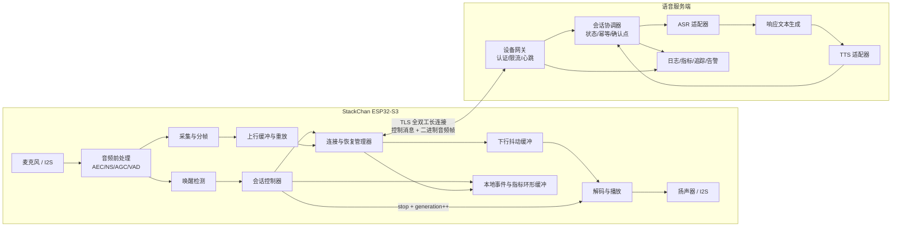
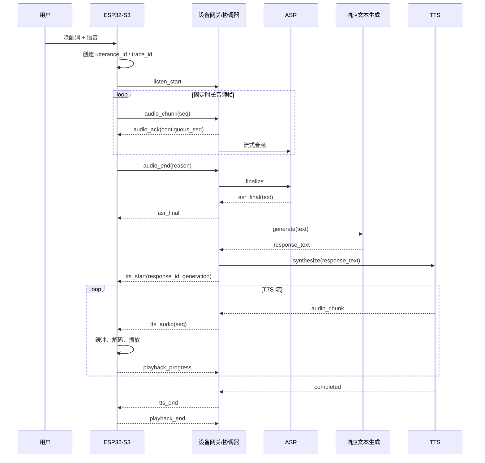
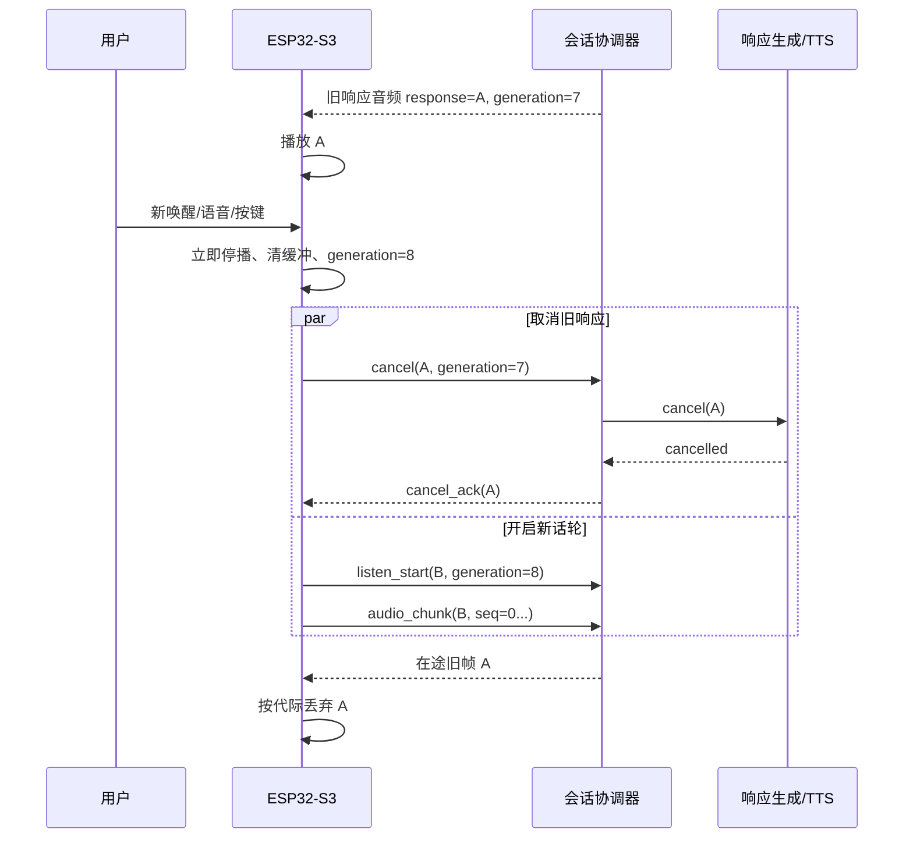

# 系统架构与关键流程

## 1. 架构原则

- 本地优先打断：停播动作在设备侧闭环，网络只承担取消传播。
- 业务标识跨连接稳定：重连替换传输连接，同时保留可恢复的话轮与响应身份。
- 控制面与音频面共享一条全双工会话，并以独立消息类型和有界队列隔离。
- 每一层拥有单一超时和失败责任，所有失败收敛为协议终态。
- 设备资源和网络均视为有界，背压、缓冲、重试都有上限。

## 2. 逻辑组件

## 3. 组件职责与边界

| 组件 | 核心职责 | 明确边界 |
|---|---|---|
| 音频前处理 | 回声消除、降噪、增益、VAD，向唤醒和采集提供统一 PCM | 不管理会话和网络 |
| 唤醒检测 | 常驻检测唤醒词，输出置信度和单调时间戳 | 不直接启停网络或播放器 |
| 会话控制器 | 设备状态机、标识生成、打断仲裁、代际切换 | 不持有长时音频数据 |
| 上行缓冲 | 分帧、编号、保留未确认帧、按确认点重放 | 容量达到上限时终止话轮，不无限堆积 |
| 连接管理器 | 认证握手、心跳、重连、流控和消息路由 | 不决定业务响应内容 |
| 下行与播放器 | 顺序校验、抖动缓冲、解码、播放进度和即时停止 | 只接受当前 `response_id/generation` |
| 设备网关 | 连接终止、认证、能力协商、限流、路由 | 不承载 ASR/TTS 业务状态 |
| 会话协调器 | 服务端状态机、幂等、序号确认、取消传播、短期恢复状态 | 不内嵌供应商 SDK 逻辑 |
| ASR 适配器 | 提交音频、结束识别、归一化结果与错误 | 最终文本只由协调器发布一次 |
| 响应文本生成 | 把识别文本转成待播报文本 | 业务语义由产品另行定义 |
| TTS 适配器 | 流式合成、分片、取消、格式归一化 | 不决定播放代际有效性 |
| 观测平台 | 聚合追踪、指标、事件和告警 | 默认不接收原始音频 |

## 4. 正常时序

## 5. 打断时序与竞态规则

竞态裁决：

1. 设备本地打断时间早于同一时刻到达的播放完成和音频帧。
2. `generation` 单调递增且不回退；连接恢复不得恢复旧代际。
3. `cancel`、`cancel_ack`、TTS 回调和播放结束均可重复，终态写入采用幂等比较。
4. 新话轮上行与旧响应取消可以并发，服务端资源配额优先保障新话轮。

## 6. 恢复模型

### 6.1 连接恢复

- 心跳与读写错误触发断线判定。
- 重连采用带随机抖动的指数退避，并设置单次连接超时和最大退避上限。
- 恢复握手携带上一 `session_id`、设备启动标识、当前业务状态、话轮/响应标识和连续确认点。
- 服务端返回 `resumed`、`restart_utterance` 或 `reset_session` 三种明确结果。

### 6.2 上行恢复

- 设备只重放服务端连续确认点之后、仍在有界缓冲内的音频帧。
- 服务端按序号去重，并在发现不可修复缺口时终止识别。
- 缓冲缺失、会话过期、ASR 上下文丢失均映射为 `restart_utterance`；设备给出失败反馈并回到 `READY`。

### 6.3 下行恢复

- 设备定期报告最后连续接收序号与已播放位置。
- 短时恢复可从服务端缓存的未播放位置续传，仍需匹配当前 `generation`。
- 服务端缓存不足、响应已过期或代际已变化时终止旧播放，设备回到 `READY`。

### 6.4 服务依赖恢复

- ASR、响应生成和 TTS 具有独立超时及熔断状态。
- 依赖失败只终止相关话轮；设备连接和后续唤醒能力继续存活。
- 重试仅用于明确可安全重试且有幂等键的调用；未知结果通过状态查询或终止收敛。

## 7. 部署与扩展约束

- 网关保持轻状态，可按设备稳定路由到会话协调器。
- 可恢复状态保留时间覆盖最大重连窗口，并在过期后确定性清理。
- ASR/TTS 适配器通过稳定内部接口隔离供应商差异。
- 音频帧、结构化事件和控制消息使用独立配额，遥测拥塞不得阻塞实时音频。
- 扩容、滚动升级和单实例故障期间，活动会话按恢复协议重建或显式终止。
