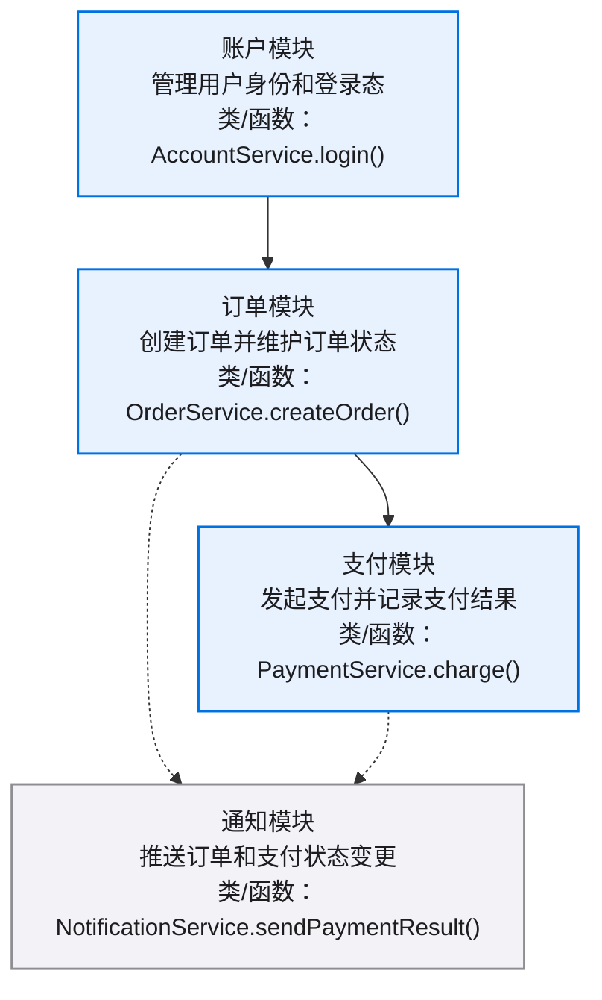
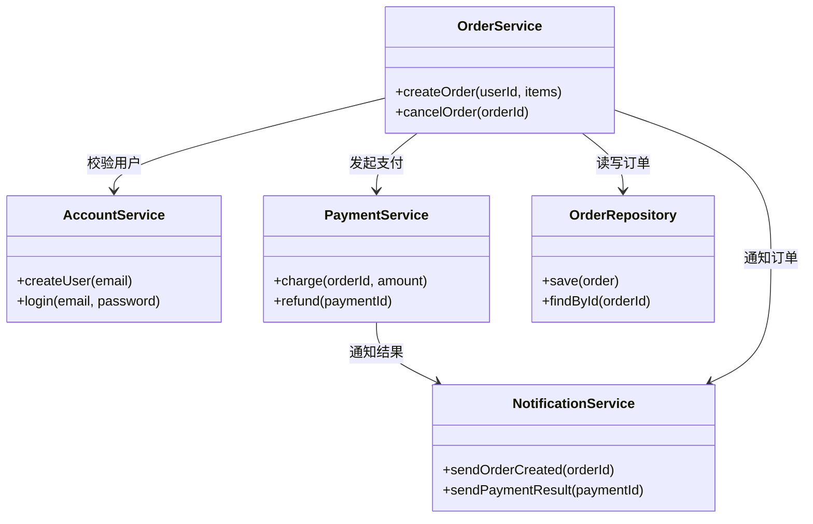
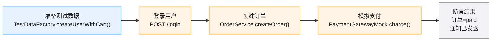
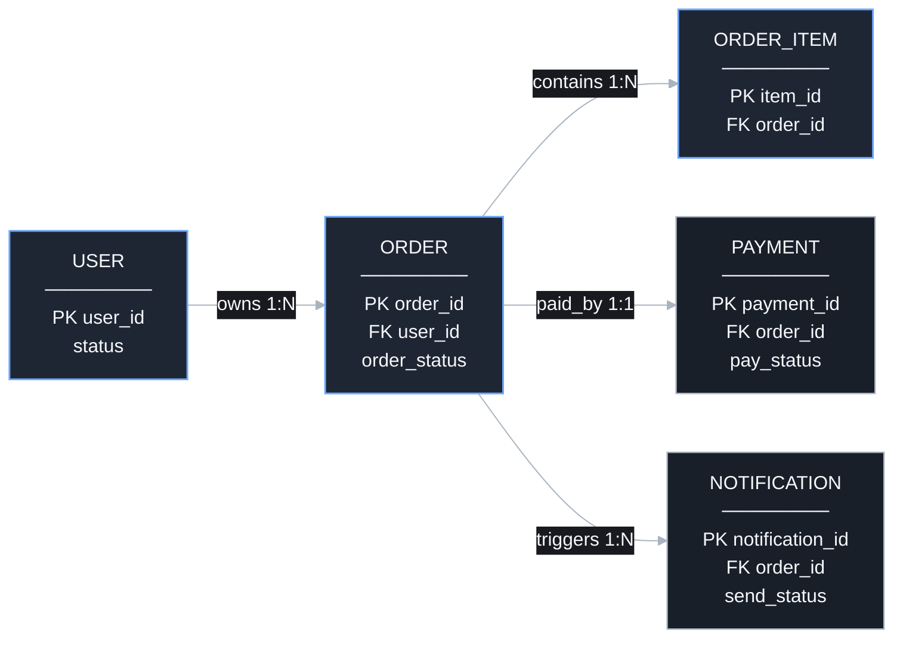

# 示例图集

> 用于验证 x-spec `diagrams.md` 模板效果：总览节点包含中文模块作用和关键类/函数，数据关系图在暗色预览里保持可读。

## 目录

- [总览](#总览)
- [类关系](#类关系)
- [E2E 测试链路](#e2e-测试链路)
- [数据关系](#数据关系)

图例：总览节点写模块名、中文作用、关键类/函数；数据关系节点统一深色实体样式。

## 总览

[模块级依赖图：每个节点说明模块作用，并给出关键类/函数名]

## 类关系

[核心类关系图：展示服务类、仓储类和通知类之间的调用边界]

## E2E 测试链路

[从测试数据准备到结果断言的完整验证路径]

## 数据关系

[数据关系图：一个实体一个紧凑节点，关系边表达方向和基数]

