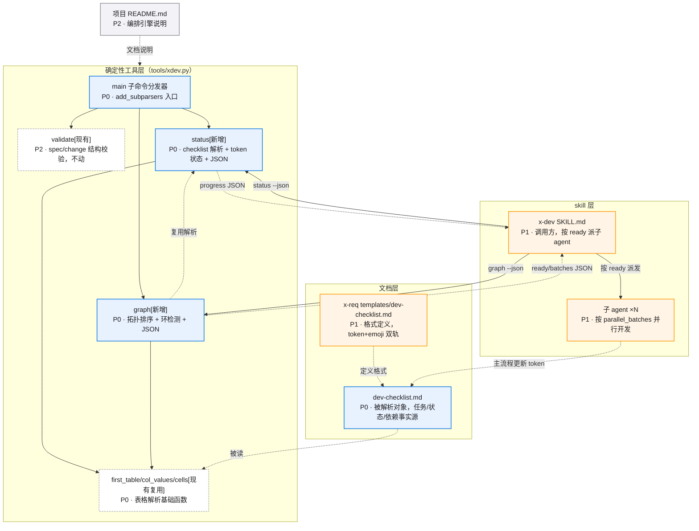

# xdev-orchestration-engine · 模块/组件图

> 来源：x-req 阶段产出。README.md 是文字事实源，本文件是架构拆分的只读视图——模块、边界或任务切分变化时同步更新。
>
> **查看与缩放**：GitHub 渲染 mermaid 自带缩放/平移控件；VS Code 建议安装 Mermaid Chart（官方）或 Markdown Preview Enhanced 插件。

图例：🔵 P0 阻塞性/核心 · 🟠 P1 必须完成/主要 · ⚪ P2 增强/辅助

