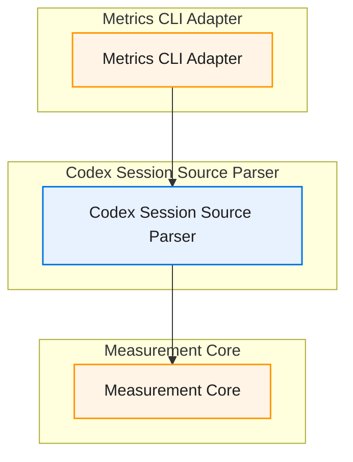

# codex-session-extraction · 模块/组件图

> 来源：x-req2 阶段产出。归属 spec 包的 `modules.md` 是文字事实源，本文件是架构拆分的只读视图——模块、边界或任务切分变化时同步更新，且改动先回到 x-spec2，不在这里单方面改。
>
> **查看与缩放**：GitHub 渲染 mermaid 自带缩放/平移控件；VS Code 建议安装 Mermaid Chart（官方）或 Markdown Preview Enhanced 插件。

图例：🔵 P0 阻塞性/核心 · 🟠 P1 必须完成/主要 · ⚪ P2 增强/辅助

