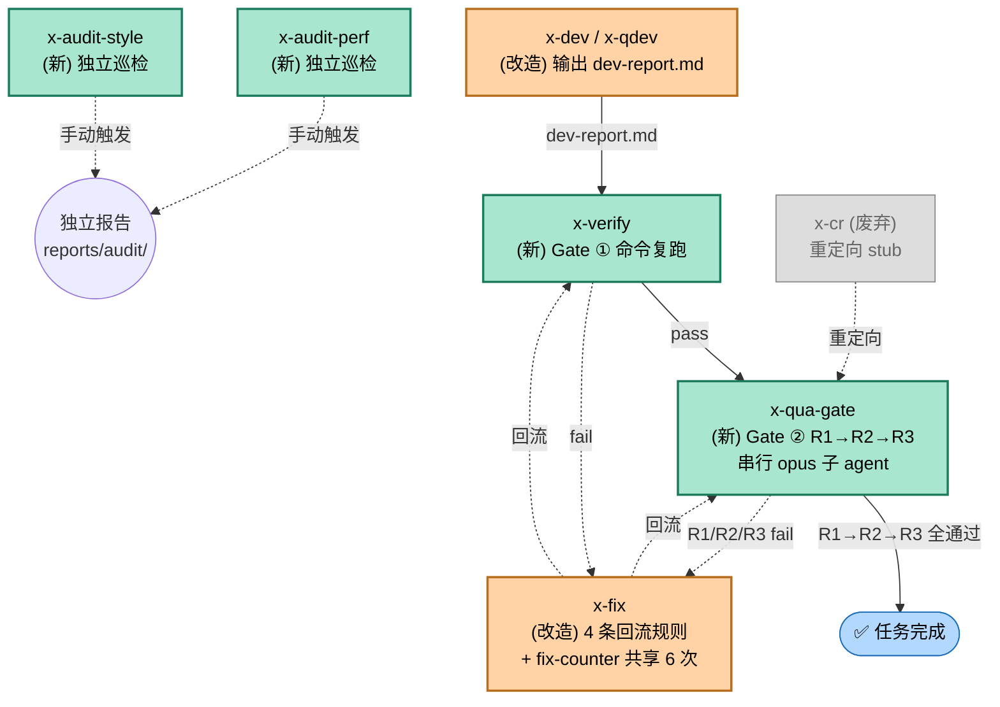
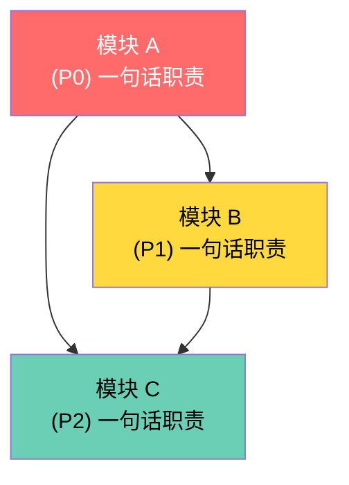

# x-req 模块依赖图 · 范例

> 这张图演示的是 **x-req 阶段在 README.md 中应该顺手吐出的 mermaid 块**。数据源自仓库里真实 task `dev-pipeline/tasks/qa-gate-pipeline/`，不是虚构。
>
> **怎么看效果**：
> - VS Code：装个内置 Markdown Preview Mermaid Support 扩展，或用 `Markdown Preview Enhanced`，双击本文件 → 右上角预览
> - GitHub：直接 push 上去，README 渲染时 mermaid 自动出图
> - 浏览器：把 mermaid 代码贴到 https://mermaid.live 看

---

## qa-gate-pipeline 模块依赖图（真实数据）



**图例**：
- 🟢 绿底 = 本次新增模块（x-verify / x-qua-gate / R1/R2/R3 / x-audit-*）
- 🟠 橙底 = 改造现有模块（x-dev / x-qdev / x-fix）
- ⚪ 灰虚线 = 废弃但保留（x-cr 重定向）
- 🔵 蓝底 = 终态
- 实线 = 主流程，虚线 = 回流 / 重定向 / 独立触发

---

## 这张图能看出什么

一眼看清的事：
1. **主链路是单线串行**：dev → verify → qua-gate → done
2. **回流目标只有 2 个**（x-verify 和 x-qua-gate），不是任意跳
3. **独立巡检不在主链路**——视觉上就被剥离开
4. **x-cr 不是入口**，是被重定向的 alias
5. **新 vs 改造 vs 废弃**用颜色一眼区分，比读文字快

看不出的事（要别的图补）：
- 每个 reviewer 内部的 prompt 检查清单 → 要 R1/R2/R3 各自的逻辑图
- 数据结构（dev-report.md 的字段）→ 要 schema 图
- 时序（谁先跑谁后跑、超时如何）→ 要 sequence diagram

---

## 如果集成到 x-req 模板里，长这样

x-req 的 SKILL.md 里 README.md 模板，**在"模块依赖关系"段把现有的文字描述改成 mermaid 块**：

````markdown
## 模块依赖关系


````

LLM 写 README 时按这个模板填——节点数量 = 模块数，颜色 = 优先级，箭头 = 依赖。零额外数据，全是 README 已有信息。
