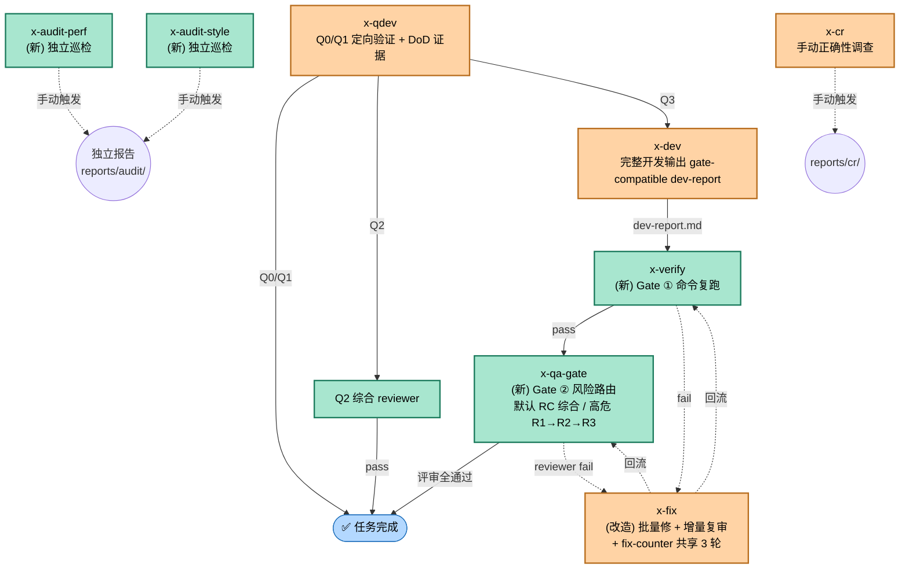
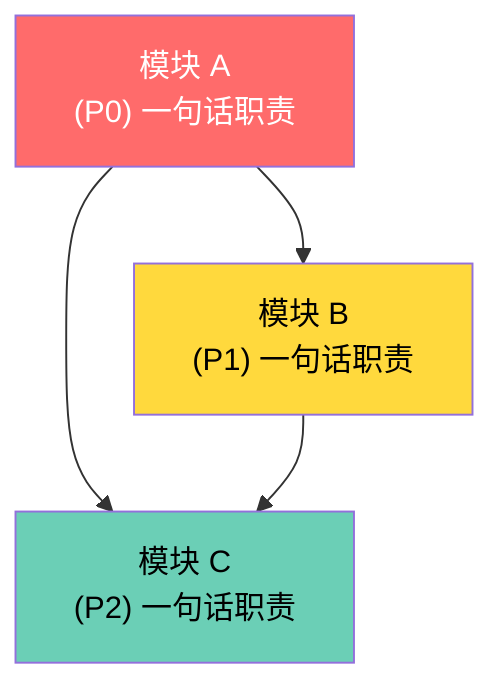

# x-req 模块依赖图 · 范例

> 这张图演示的是 **x-req 阶段在 README.md 中应该顺手吐出的 mermaid 块**。数据源自仓库里真实 task `dev-pipeline/tasks/qa-gate-pipeline/`，不是虚构。
>
> **怎么看效果**：
> - VS Code：装个内置 Markdown Preview Mermaid Support 扩展，或用 `Markdown Preview Enhanced`，双击本文件 → 右上角预览
> - GitHub：直接 push 上去，README 渲染时 mermaid 自动出图
> - 浏览器：把 mermaid 代码贴到 https://mermaid.live 看

---

## qa-gate-pipeline 模块依赖图（真实数据）


```mermaid
flowchart TD
  classDef new fill:#a8e6cf,stroke:#1d7c5e,stroke-width:2px,color:#000
  classDef changed fill:#ffd3a5,stroke:#b86e1f,stroke-width:2px,color:#000
  classDef done fill:#b3d8ff,stroke:#1e6fbb,color:#000

  Dev["x-dev<br/>完整开发输出 gate-compatible dev-report"]:::changed
  Verify["x-verify<br/>(新) Gate ① 命令复跑"]:::new
  Qua["x-qa-gate<br/>(新) Gate ② 风险路由<br/>默认 RC 综合 / 高危 R1→R2→R3"]:::new
  Fix["x-fix<br/>(改造) 批量修 + 增量复审<br/>+ fix-counter 共享 3 轮"]:::changed
  Done(["✅ 任务完成"]):::done

  Qdev["x-qdev<br/>Q0/Q1 定向验证 + DoD 证据"]:::changed
  Qreview["Q2 综合 reviewer"]:::new

  AuditP["x-audit-perf<br/>(新) 独立巡检"]:::new
  AuditS["x-audit-style<br/>(新) 独立巡检"]:::new
  Indep((独立报告<br/>reports/audit/))

  Cr["x-cr<br/>手动正确性调查"]:::changed
  CrReport(("reports/cr/"))

  Dev -->|dev-report.md| Verify
  Verify -->|pass| Qua
  Qua -->|评审全通过| Done
  Verify -.fail.-> Fix
  Qua -.reviewer fail.-> Fix
  Fix -.回流.-> Verify
  Fix -.回流.-> Qua

  Qdev -->|Q0/Q1| Done
  Qdev -->|Q2| Qreview
  Qreview -->|pass| Done
  Qdev -->|Q3| Dev

  Cr -.手动触发.-> CrReport
  AuditP -.手动触发.-> Indep
  AuditS -.手动触发.-> Indep
```

**图例**：
- 🟢 绿底 = 本次新增模块（x-verify / x-qa-gate / R1/R2/R3 / x-audit-*）
- 🟠 橙底 = 改造现有模块（x-dev / x-qdev / x-fix / x-cr）
- 🔵 蓝底 = 终态
- 实线 = 开发与验证路径，虚线 = 回流 / 独立触发

---

## 这张图能看出什么

一眼看清的事：
1. **完整链路串行**：dev → verify → qa-gate → done
2. **qdev 按风险分流**：Q0/Q1 证据闭环，Q2 综合 reviewer，Q3 升级完整链路
3. **回流目标保持 2 个**：x-verify 和 x-qa-gate
4. **x-cr 与 audit 独立触发**，各自产出调查或巡检报告
5. **新增与改造模块**用颜色区分

看不出的事（要别的图补）：
- 每个 reviewer 内部的 prompt 检查清单 → 要 R1/R2/R3 各自的逻辑图
- 数据结构（dev-report.md 的字段）→ 要 schema 图
- 时序（谁先跑谁后跑、超时如何）→ 要 sequence diagram

---

## 如果集成到 x-req 模板里，长这样

x-req 的 SKILL.md 里 README.md 模板，**在"模块依赖关系"段把现有的文字描述改成 mermaid 块**：

````markdown
## 模块依赖关系


```mermaid
flowchart TD
  classDef p0 fill:#ff6b6b,color:#fff
  classDef p1 fill:#ffd93d,color:#000
  classDef p2 fill:#6bcfb6,color:#000

  ModA["模块 A<br/>(P0) 一句话职责"]:::p0
  ModB["模块 B<br/>(P1) 一句话职责"]:::p1
  ModC["模块 C<br/>(P2) 一句话职责"]:::p2

  ModA --> ModB
  ModA --> ModC
  ModB --> ModC
```
````

LLM 写 README 时按这个模板填——节点数量 = 模块数，颜色 = 优先级，箭头 = 依赖。零额外数据，全是 README 已有信息。
