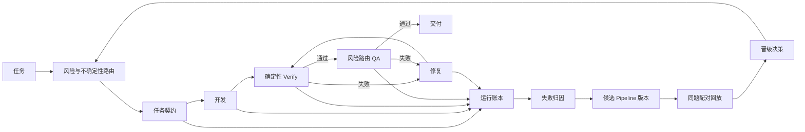

我推荐构建“生产执行环 + 离线进化环”，核心可以概括成：

> 目标 → 证据 → 归因 → 候选改动 → 配对回放 → 晋级/回滚

生产任务始终绑定已发布的 pipeline 版本。进化环生成候选版本，在隔离评测中证明有效后晋级。这样准确性、正确性、Token 和审计可以同时成立。



## 一、把现有五个步骤收敛成四个稳定层

| 稳定层 | 当前能力 | 建议 |
|---|---|---|
| 契约层 | spec、req | spec 按风险进入；req 统一生成 `TaskContract` |
| 执行层 | dev | 保留，严格消费 TaskContract |
| 事实层 | verify | 所有任务必跑，只输出可复现事实 |
| 判断层 | qa、fix | QA 按风险和不确定性选择审查维度；fix 有界回流 |

具体路由：

- Q0/Q1：`req-lite → dev → verify → 交付`，抽取 5%～10% 做影子 QA。
- Q2：`spec2 → req → dev → verify → 综合 QA → 交付`。
- Q3：`explore → spec2 → req → dev → verify → 独立 q1/q2/q3 → 交付`。
- 任何失败：进入 `fix → verify → 增量 QA`，达到轮次上限后转人工决策。

这里最重要的新增概念是 `TaskContract`。它是 dev、verify、qa 共同消费的稳定接口，至少包含：

```yaml
task_id:
source_spec:
requirements:
scenarios:
primary_module:
affected_modules:
invariants:
allowed_files:
risk:
manual_acceptance:
```

Q0/Q1 可以直接生成轻量 TaskContract；Q2/Q3 从 spec2 编译得到。这样下游无需理解上游究竟走了多少步。

## 二、质量与 Token 采用硬门槛排序

建议避免把正确率和 Token 加权成一个总分。单一总分容易让低成本掩盖严重错误。

优化目标定义为：

```text
最小化：
TokensToAccepted =
  初次执行 + Verify + QA + Fix + 重跑的全部 Token
  ------------------------------------------------
                    最终正确交付数

约束：
1. P0/关键不变量回归数 = 0
2. 意图符合率 >= 当前版本
3. 技术正确率 >= 当前版本
4. QA 错放率不得上升
```

核心指标只保留六个：

- `intent_pass_rate`：实现是否满足用户意图和 Requirement。
- `correctness_pass_rate`：边界、失败路径、状态和并发是否正确。
- `first_pass_rate`：首次开发经过 verify/QA 直接通过的比例。
- `false_accept_rate`：错误实现被流水线放行的比例，优先级最高。
- `tokens_to_accepted`：完成一个正确任务实际消耗的全部 Token。
- `repair_rounds`：每个正确任务经历的平均修复轮数。

现有 pilot 已说明质量和成本需要一起判断：使用 x-spec2 的单样本通过率为 83.33%，总 Token 为 654,880；基线通过率为 33.33%，总 Token 为 448,691。原始 Token 会选择便宜方案，`tokens_to_accepted` 会选择更有效的方案。[现有 benchmark](/Volumes/machub_app/proj/x-dev-pipeline/skills/x-spec2-workspace/iteration-2/benchmark.md:1)

## 三、增加统一运行账本

每次生产任务和评测任务都生成一个 `pipeline_run_id`，各阶段追加事件：

```json
{
  "pipeline_run_id": "run-...",
  "parent_run_id": null,
  "task_snapshot_sha": "...",
  "repo_sha": "...",
  "pipeline_version": "...",
  "skill_versions": {},
  "model": "...",
  "stage": "verify",
  "input_artifact_hashes": [],
  "output_artifact_hashes": [],
  "started_at": "...",
  "duration_ms": 1234,
  "tokens": {
    "input": 0,
    "cached_input": 0,
    "output": 0,
    "reasoning": 0,
    "total": 0
  },
  "status": "passed",
  "reason_codes": [],
  "evidence_refs": []
}
```

账本采用追加写入。所有结论都能追溯到：

`pipeline 版本 → 输入快照 → 阶段产物 → 验证证据 → QA 判断 → 晋级依据`

现有 `tools/metrics.py` 已经具备真实 Token、时长、独立评分和 paired comparison 的基础，可以扩展成全 pipeline collector。[metrics 设计](/Volumes/machub_app/proj/x-dev-pipeline/openspec/changes/xspec2-evaluation-metrics/design.md:95)

## 四、失败归因必须找到“最早出错阶段”

QA 发现问题的阶段只是发现位置。归因系统需要记录问题最早进入证据链的位置。

建议 reason code：

- `SPEC_INTENT_GAP`：用户意图或不变量遗漏。
- `SPEC_BOUNDARY_ERROR`：模块和数据归属错误。
- `REQ_DECOMPOSITION_GAP`：任务拆解遗漏或依赖错误。
- `DEV_IMPLEMENTATION_DEFECT`：代码实现错误。
- `VERIFY_COVERAGE_GAP`：Scenario 缺少可复跑证据。
- `VERIFY_FALSE_PASS`：验证命令通过，但错误实现仍存在。
- `QA_FALSE_ACCEPT`：QA 放行错误实现。
- `QA_FALSE_BLOCK`：QA 阻止正确实现。
- `ROUTER_UNDER_REVIEW`：风险定低，审查不足。
- `ROUTER_OVER_REVIEW`：风险定高，Token 浪费。
- `CONTEXT_BLOAT`：读取范围过大或重复加载。
- `CONTRACT_DRIFT`：生产者和消费者读取不同协议。

每个 P0/P1 问题形成一个最小回归案例，进入长期回放集。

## 五、进化单位是版本化候选包

每一次进化只修改一个主要变量，例如：

- skill 提示词；
-模板；
- validator；
- 上下文裁剪规则；
- 风险路由策略；
- reviewer 组合；
- Token 预算。

建议保存：

```text
evolution/<evolution-id>/
├── hypothesis.md
├── trigger-runs.json
├── baseline-manifest.json
├── candidate-manifest.json
├── change.diff
├── evaluation-plan.json
├── paired-results.json
├── decision.md
└── rollback.json
```

`hypothesis.md` 必须写清：

- 哪类失败触发本次进化；
- 归因证据来自哪些 run；
- 修改哪个能力；
- 预期改善哪个指标；
- 可能伤害哪些场景；
- 什么结果触发拒绝或回滚。

## 六、采用逐级配对回放控制评测成本

候选版本和当前版本使用相同任务、模型、仓库 SHA、权限、预算和评分规则。执行 agent 只看到任务，独立 grader 持有隐藏验收标准。

评测顺序：

1. 静态契约和 validator，失败立即停止。
2. 触发本次进化的最小反例，先跑一轮。
3. 目标反例通过后重复三轮，检查稳定性。
4. 运行相关模块回归集。
5. 运行隐藏 holdout。
6. 小流量 canary，观察真实任务。
7. 生成晋级或拒绝记录。

初始晋级门槛建议：

- 所有目标反例三轮全通过；
- 关键不变量和 P0 holdout 100% 通过；
- 整体正确率不低于当前版本；
- QA 错放率不升高；
- `tokens_to_accepted` 下降，或正确率提升足以覆盖新增成本；
- 所有结果具备完整 run、版本、证据和 grader 追溯。

## 当前仓库的第一优先级

先完成协议收敛，再增加进化控制面。当前 `x-dev` 明确规定 Q0/Q1 交付、Q2 综合审查、Q3 三审查，[x-dev 路由](/Volumes/machub_app/proj/x-dev-pipeline/skills/x-dev/SKILL.md:23)；`x-qa-gate` 正文却写成 Q0/Q1 三 reviewer，并继续读取旧版 spec 字段，[x-qa-gate 路由](/Volumes/machub_app/proj/x-dev-pipeline/skills/x-qa-gate/SKILL.md:9)。这类 `CONTRACT_DRIFT` 会污染全部指标和归因。

建议按以下顺序落地：

1. 收敛 x-req2、x-dev、x-verify、x-qa-gate、x-fix 的唯一协议。
2. 实现 `pipeline_run_id + stage events + reason_code`。
3. 将现有 metrics 扩展到整条 pipeline。
4. 建立真实失败回归集、成功保护集和隐藏 holdout。
5. 实现 baseline/candidate 配对回放与晋级记录。
6. 引入风险路由和低风险影子 QA，持续校准准确率与 Token。

第一个正式 spec 建议命名为 `pipeline-self-evolution`，首个开发 task 聚焦 `pipeline-run-observability`。这个顺序符合 x-spec 的“不变量 → 必要能力 → 模块 → 验证”方法，也能最快建立后续所有进化都依赖的可信证据底座。