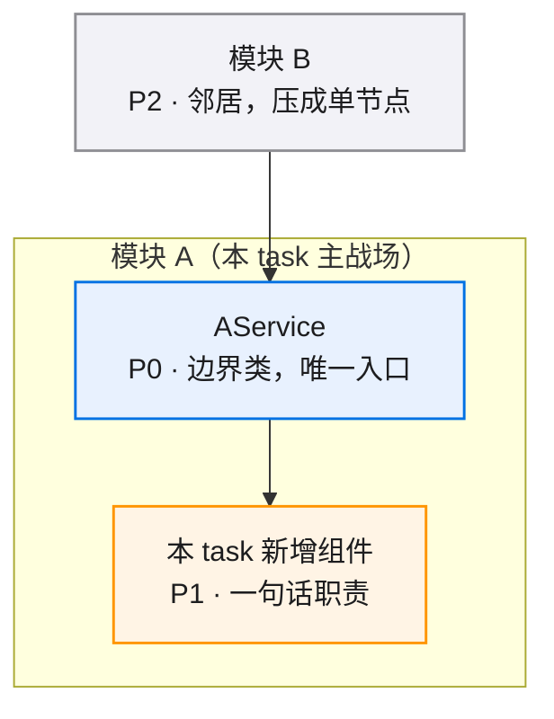

# <TASK_NAME> · 模块/组件图

<!--
x-req diagram 模板填写规则：
- 替换标题中的 TASK_NAME 为实际 task 名，保留查看/缩放建议引用块。
- 替换 mermaid 代码块中的占位模块为实际内容。
- 节点来自 README.md "涉及模块"列出的模块 + 本 task 新增组件。
- 节点格式：ID["名称 P0/P1/P2 · 一句话职责"]:::p{0|1|2}。
- 单图节点上限约 12 个；超限时压缩同质节点并使用 "×N" 后缀。
- subgraph 一律按模块划分，一个模块一个框，框线即模块边界。
- 模块清单必须与 README.md 完全一致。
-->

> 来源：x-req 阶段产出。README.md 是文字事实源，本文件是只读视图——模块变化时同步更新。
>
> **查看与缩放**：GitHub 渲染 mermaid 自带缩放/平移控件；VS Code 建议安装 Mermaid Chart（官方）或 Markdown Preview Enhanced 插件。

图例：🔵 P0 阻塞性/核心 · 🟠 P1 必须完成/主要 · ⚪ P2 增强/辅助

