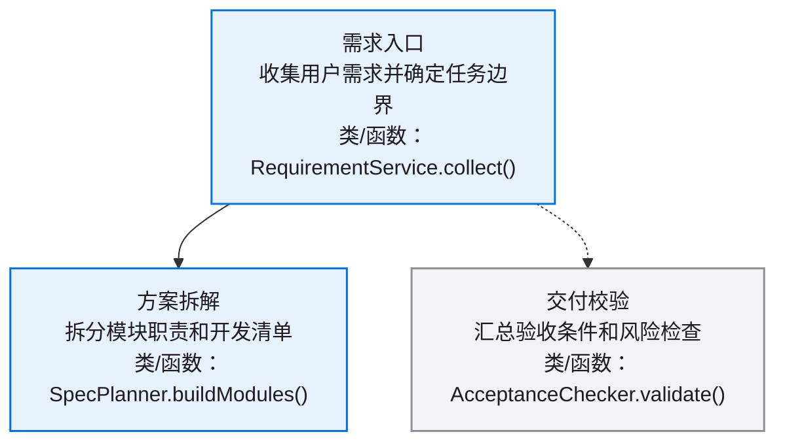
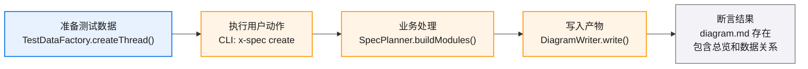
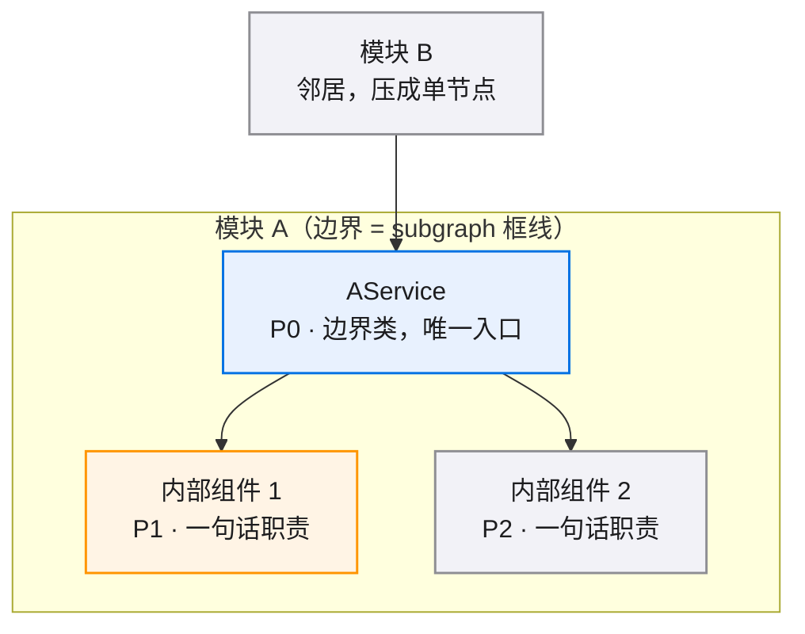
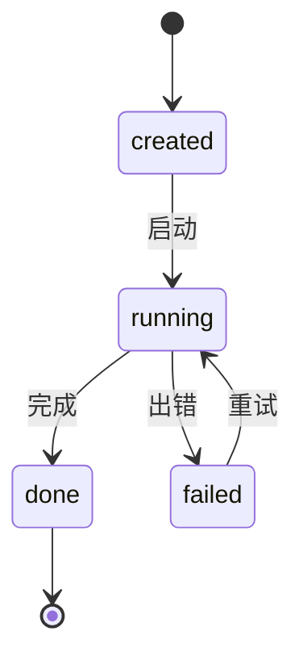
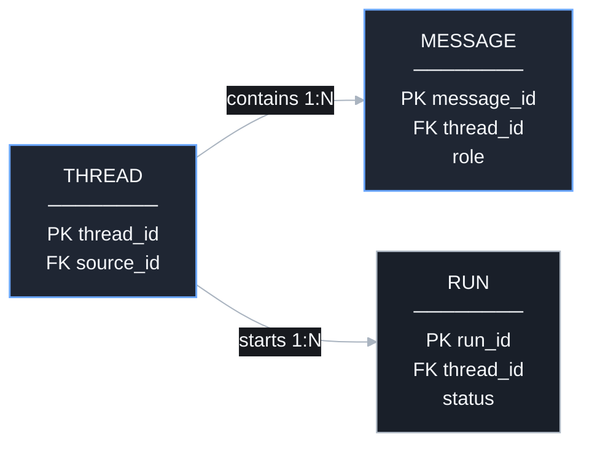

# <SPEC_NAME> · 图集

> 本 spec 的唯一图源：所有 mermaid 图集中于此，按模块分节。02/03/04 是文字事实源，本文件是只读视图——增减模块/组件时同步更新对应节。
>
> **查看与缩放**：GitHub 渲染 mermaid 自带缩放/平移控件；VS Code 建议安装 Mermaid Chart（官方）或 Markdown Preview Enhanced 插件以支持缩放。

<!-- 模板说明：skills/x-spec/templates/TEMPLATE_GUIDE.md。生成产物时删除本注释。 -->

## 目录

- [总览](./diagrams.md#总览)
- [E2E 测试链路](./diagrams.md#e2e-测试链路)
- [模块 A](./diagrams.md#模块-a)
- [模块 B](./diagrams.md#模块-b)

图例：总览节点写模块名、中文作用、关键类/函数；局部组件图可按 🔵 核心 · 🟠 主要 · ⚪ 辅助 配色。

## 图类型规范

| 节 | 放什么图 | mermaid 类型 |
|----|---------|-------------|
| 总览 | 模块级依赖图：每个模块一个节点，只画模块间关系；节点写中文模块作用和关键类/函数名 | `flowchart TD` |
| E2E 测试链路 | 从测试数据准备、用户动作、系统处理到断言的验证路径 | `flowchart LR` |
| 模块节 | 局部组件依赖图、核心流程图、时序图、状态流转图、数据关系图 | `flowchart TD/LR` / `sequenceDiagram` / `stateDiagram-v2` |

写图顺序：先总览，再 E2E 测试链路，再按模块拆局部图。单图节点约 12 个以内；更大的图拆到模块节。

## 总览

[模块级依赖图：每模块一个节点，只画模块间关系；每个节点写中文模块作用和关键类/函数名]

## E2E 测试链路

[从测试数据准备到断言的端到端验证路径；节点写动作、入口、关键类/函数或断言点]

## 模块 A

[该模块的局部图，按需保留小节：组件依赖 / 流程 / 时序 / 状态 / 数据关系，没有内容的小节删掉]

### 组件依赖

### 状态流转

### 数据关系

## 模块 B

[同上结构，按需]
