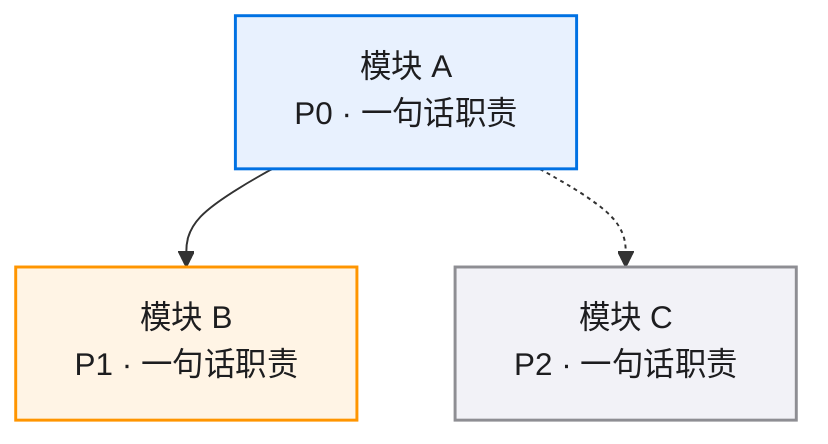
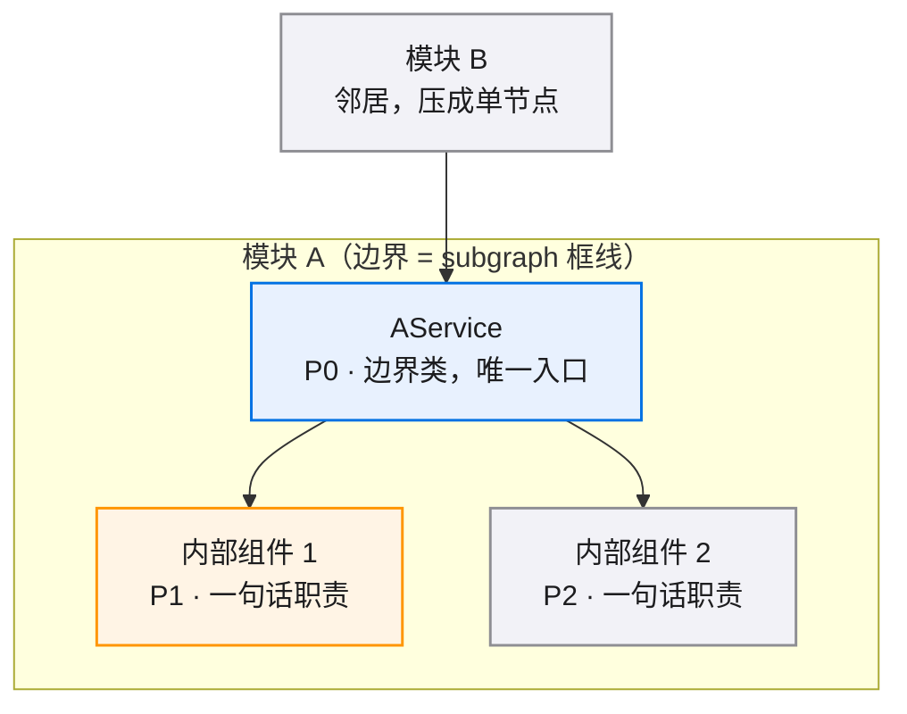
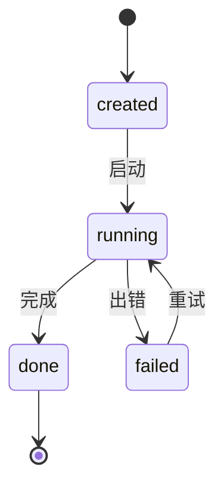

# <SPEC_NAME> · 图集

> 本 spec 的唯一图源：所有 mermaid 图集中于此，按模块分节。02/03/04 是文字事实源，本文件是只读视图——增减模块/组件时同步更新对应节。
>
> **查看与缩放**：GitHub 渲染 mermaid 自带缩放/平移控件；VS Code 建议安装 Mermaid Chart（官方）或 Markdown Preview Enhanced 插件以支持缩放。

## 目录

- [总览](#总览)
- [模块 A](#模块-a)
- [模块 B](#模块-b)

图例：🔵 P0 核心/阻塞 · 🟠 P1 主要/必须 · ⚪ P2 辅助/可选

## 总览

[模块级依赖图：每模块一个节点，只画模块间关系]

## 模块 A

[该模块的局部图，按需保留小节：组件依赖 / 流程 / 时序 / 状态 / ER，没有内容的小节删掉]

### 组件依赖

### 状态流转

## 模块 B

[同上结构，按需]
